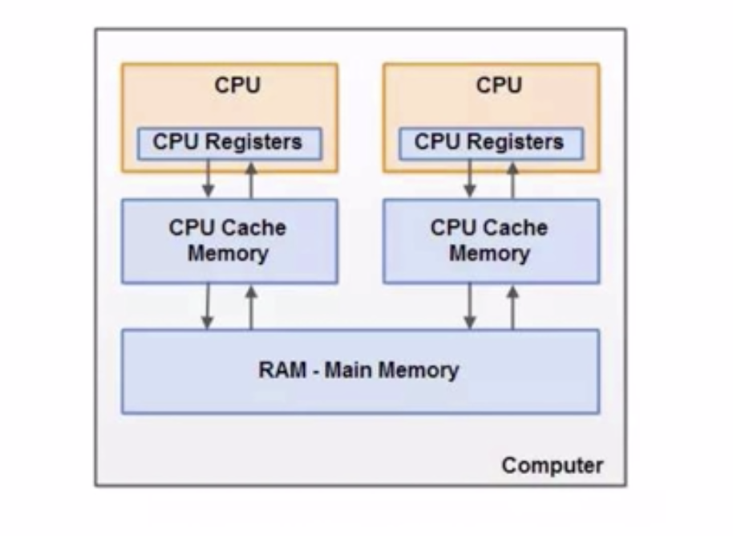
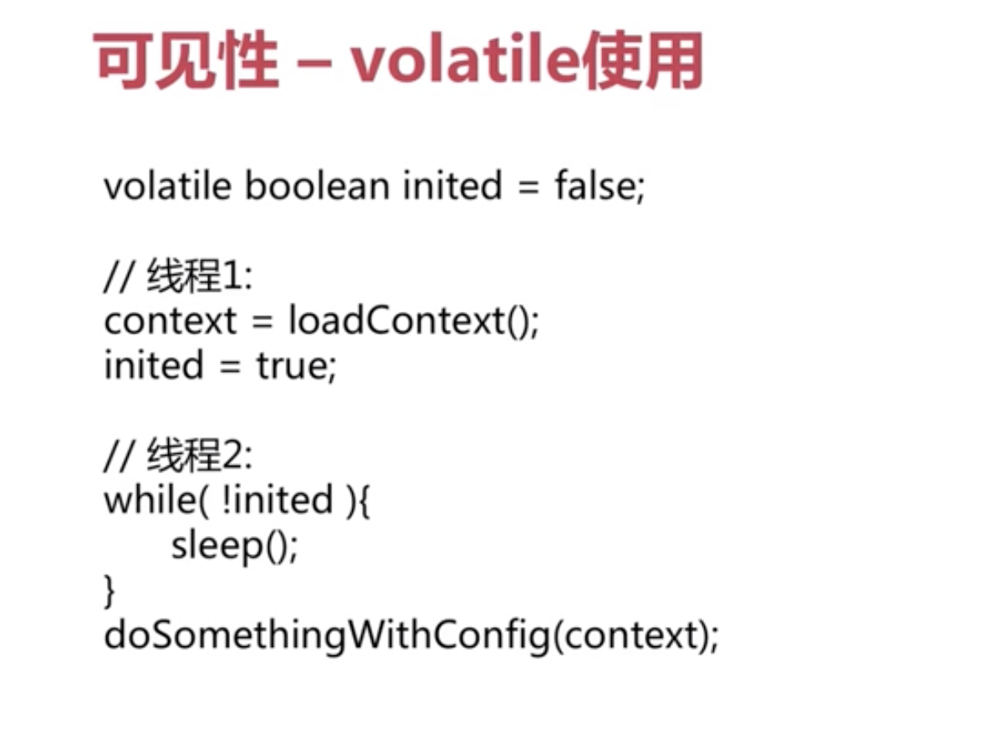

# Java并发编程实战

[TOC]

基础知识讲解与核心知识准备：


并发：

同时拥有两个或者多个线程，如果程序在单核处理器上运行，多个线程将交替地换入或者换出内存，这些线程同时“存在”的，每个线程都处于执行过程中的某个状态，如果运行在多核处理器上，此时，程序中每个线程都将分配到一个处理器核上，因此可以同时运行。

多个线程操作相同的资源，保证线程安全，合理使用资源。

高并发：

高并发（High Concurrency）是互联网分布式系统架构设计中必须考虑的因素之一，它通常是指通过设计保证系统能够**同时并行处理**很多请求。

服务能同时处理很多请求，提升程序性能。


## 基础知识讲解与核心知识准备

### cpu多级缓存-缓存一致性


**问题**：为什么需要CPU cache：

CPU的频率太快了，快到主存跟不上，这样在处理器时钟周期内，CPU常常需要等待主存，浪费资源。所以cache的出现，是为了**缓解CPU和内存之间速度的不匹配问题**。（结构：cpu->cache->memory）

**问题**：Cpu cache有什么意义：

- 时间局限性：如果某个数据被访问，那么在不久的将来它可能被再次访问。
- 空间局限性：如果某个数据被访问，那么与它相邻的数据很快也可能被访问。


四种状态：

- M：Modified 被修改

- E：Exclusive 独享

- S：Shared 共享

- I：Invalid 无效

四种操作：

- local read ：读本地缓存中的数据
- local write：将数据写到本地缓存
- remote read：将内存中的数据读取过来
- remote write：将数据写回到主存

**监听和广播**


### Java内存模型（Java Memory Model，JMM）

规范了java虚拟机与计算机内存是如何协同工作的


堆：存取速度慢一些，动态生成的。 



关联如下：


同步的八种操作


Java内存模型-同步操作与规则


### 并发的优势与风险


总结：

- cpu多级缓存：缓存一致性，乱序执行优化
- Java内存模型：JMM规定、抽象结构，同步的八种操作和规则
- Java并发的优势与风险


## 多线程并发编程与线程安全

**并发模拟**

- Postman：http请求模拟工具

- Apache Bench（AB）：Apache附带的工具，测试网站性能

  

  

  Requests per second:吞吐率

  Time per request：用户平均等待时间

  Time per request：服务器平均等待时间

  Transfer rate ：total transfered/Time taken for tests

- JMeter：Apache组织开发的压力测试工具

  

  

  线程数：虚拟用户数，

  Ramp-Up Period：虚拟用户增长时长

- 代码：Semaphore、CountDownLatch等

编码测试

CountDownLatch：可以阻塞进程，当进程满足某种条件的时候再继续执行。


信号量：阻塞进程控制同一时间的并发量。


模拟代码

```java
package com.mmall.concurrency;

import com.mmall.concurrency.annoations.NotThreadSafe;
import lombok.extern.slf4j.Slf4j;

import java.util.concurrent.CountDownLatch;
import java.util.concurrent.ExecutorService;
import java.util.concurrent.Executors;
import java.util.concurrent.Semaphore;

@Slf4j
@NotThreadSafe
public class ConcurrencyTest {

    // 请求总数
    public static int clientTotal = 5000;

    // 同时并发执行的线程数
    public static int threadTotal = 200;

    public static int count = 0;

    public static void main(String[] args) throws Exception {
        ExecutorService executorService = Executors.newCachedThreadPool();
        final Semaphore semaphore = new Semaphore(threadTotal);
        final CountDownLatch countDownLatch = new CountDownLatch(clientTotal);
        for (int i = 0; i < clientTotal ; i++) {
            executorService.execute(() -> {
                try {
                    semaphore.acquire();
                    add();
                    semaphore.release();
                } catch (Exception e) {
                    log.error("exception", e);
                }
                countDownLatch.countDown();
            });
        }
        countDownLatch.await();
        executorService.shutdown();
        log.info("count:{}", count);
    }

    private static void add() {
        count++;
    }
}

```


### 线程安全性


#### 原子性-Atomic包

AtomicXXX：CAS、Unsafe.compareAndSwapxxx()

CAS核心：

```java
// Object var1 当前对象， var2当前值， var4 增长量， var5 内存中实际值，底层值
public final int getAndAddInt(Object var1, long var2, int var4) {
        int var5;
        do {
            var5 = this.getIntVolatile(var1, var2);
        } while(!this.compareAndSwapInt(var1, var2, var5, var5 + var4));

        return var5;
}
```


补充：

- AtomicLong：可能需要循环更新

- LongAdder：将热点数据分离，可能有时候不准确？


原子性，锁：

- Synchronized：依赖JVM，注意Synchronzied无法被继承

  - 修饰代码块：大括号括起来的代码，作用于调用的对象
  - 修饰方法：整个方法，作用于调用的对象
  - 修饰静态方法：整个静态方法，**作用于所有对象**
  - 修饰类：括号括起来的部分，作用于所有对象

  

- Lock：依赖特殊的CPU指令，代码实现

  


#### 可见性

导致共享变量在线程间不可见的原因

- 线程交叉执行
- 重排序结合线程交叉执行
- 共享变量更新后没有在工作内存与主存间及时更新




```java
//x、y为非volatile变量
//flag为volatile变量 
x = 2;        
//语句1
y = 0;        
//语句2
flag = true;  
//语句3
x = 4;         
//语句4
y = -1;       
//语句5
```

 由于flag变量为volatile变量，那么在进行指令重排序的过程的时候，不会将语句3放到语句1、语句2前面，也不会讲语句3放到语句4、语句5后面。但是要注意语句1和语句2的顺序、语句4和语句5的顺序是不作任何保证的。

　volatile关键字禁止指令重排序有两层意思：

　　1）当程序执行到volatile变量的读操作或者写操作时，在其前面的操作的更改肯定全部已经进行，且结果已经对后面的操作可见；在其后面的操作肯定还没有进行；

　　2）在进行指令优化时，不能将在对volatile变量访问的语句放在其后面执行，也不能把volatile变量后面的语句放到其前面执行。


#### 有序性


#### happens-before原则

什么是happens-before原则：

> **happens-before：**A happens-before B就是A先行发生于B（这种说法不是很准确），定义为hb(A, B)。在Java内存模型中，happens-before的意思是前一个操作的结果可以被后续操作获取。

为什么要happens-before原则

**JVM会对代码进行编译优化，会出现指令重排序情况**，为了避免编译优化对并发编程安全性的影响，**需要happens-before规则定义一些禁止编译优化的场景**，保证并发编程的正确性。以双重检查单例示例进行分析：


上述代码中instance = new LazyDoubleCheckSingleton()并不是原子操作 ，JVM会分解成以下几个命令执行：

给对象分配内容初始化对象将初始化对象和内存地址建立关联按照上面的分解顺序（1->2->3）执行不存在任何问题，但是由于JVM编译优化的存在，可能导致2和3步骤颠倒，即按1->3->2顺序执行（这就是指令重排序）。按照1->3->2顺序执行，在多线程环境中执行getInstance就有可能出现instance已经和初始对象内存建立关联，但是对象还没有初始化完成的情况，即执行if (instance == null)的时候instance ！= null 直接返回没有初始化完成的instance，导致再使用instance实例的时候报错。volatile关键字是可以解决指令重排序问题的一种方式，具体解决方式如下：


有哪些happens-before规则

**程序次序规则：**在一个线程内一段代码的执行结果是有序的。就是还会指令重排，但是随便它怎么排，结果是按照我们代码的顺序生成的不会变。

**管程锁定规则：**就是无论是在单线程环境还是多线程环境，对于同一个锁来说，一个线程对这个锁解锁之后，另一个线程获取了这个锁都能看到前一个线程的操作结果！(管程是一种通用的同步原语，synchronized就是管程的实现）

**volatile变量规则：**就是如果一个线程先去写一个volatile变量，然后一个线程去读这个变量，那么这个写操作的结果一定对读的这个线程可见。

**线程启动规则：**在主线程A执行过程中，启动子线程B，那么线程A在启动子线程B之前对共享变量的修改结果对线程B可见。

**线程终止规则：**在主线程A执行过程中，子线程B终止，那么线程B在终止之前对共享变量的修改结果在线程A中可见。也称线程join()规则。

**线程中断规则**：对线程interrupt()方法的调用先行发生于被中断线程代码检测到中断事件的发生，可以通过Thread.interrupted()检测到是否发生中断。

**传递性规则：**这个简单的，就是happens-before原则具有传递性，即hb(A, B) ， hb(B, C)，那么hb(A, C)。

**对象终结规则：**这个也简单的，就是一个对象的初始化的完成，也就是构造函数执行的结束一定 happens-before它的finalize()方法。


## 安全发布对象


四种安全发布对象的方法：


## 线程安全策略

### 不可变对象

不可变对象需要满足的条件（如String类型）

- 对象创建以后其状态就不能修改
- 对象所有域都是final类型
- 对象时正确创建（在对象创建期间，this引用没有逸出）

final关键字：类、方法、变量

- 修饰类：不能被继承
- 修饰方法：1. **锁定方法不被继承类修改**；2. 效率
- 修饰变量：基本数据类型变量、引用类型变量（初始化后不能再指向另外对象）


```java
@ThreadSafe
public class ImmutableExample3 {

    private final static ImmutableList<Integer> list = ImmutableList.of(1, 2, 3);

    private final static ImmutableSet set = ImmutableSet.copyOf(list);

    private final static ImmutableMap<Integer, Integer> map = ImmutableMap.of(1, 2, 3, 4);

    private final static ImmutableMap<Integer, Integer> map2 = ImmutableMap.<Integer, Integer>builder()
            .put(1, 2).put(3, 4).put(5, 6).build();


    public static void main(String[] args) {
//        list.add(1);
        System.out.println(map2.get(3));
    }
}
```


### 线程封闭


把对象封装到一个对象里。

**堆栈封闭**：局部变量，无并发问题，会被拷贝到线程的栈中。

TheadLocal线程封闭：特别好的封闭方法。

维护了一个map，map的key是线程


线程封闭技术应用：数据库连接jdbc的connection对象。


补充知识：

servelet和interception。


### 线程不安全类与写法

- StringBuilder与StringBuffer

- SimpleDateFormat JodaTime
- ArrayList,HashSet,HashMap等Collections
- 先检查再执行：if(condition(a)){handle(a);}


### 同步容器

ArrayList -》 Vector，Stack

HashMap -》 HashTable（key、value不能为null）

Collections.synchronizedXXX(List、Set、Map)

同步容器性能一般

### 并发容器J.U.C

Java.util.concurrent

1. ArrayList -> CopyOnWriteArrayList:

缺点：

- 消耗内存，可能会导致full gc younge gc
- 不能用于实时读的场景，适合读多写少的场景

2. HashSet TreeSet -> CopyOnWriteArraySet ConcurrentSkipListSet

CopyOnWriteArraySet

- 适合大小很小的set
- 迭代器遍历时快

ConcurrentSkipListSet

- 支持排序

removeAll，containAll这类批量操作不是同步的。


3. HashMap、TreeMap -》 ConcurrentHashMap ConcurrentSkipListMap

ConcurrentHashMap

- 不允许空值
- 针对读操作做了大量优化，具有很高的并发性

   ConcurrentSkipListMap

- 键值有序
- 高并发表现好


## AQS开发


AQS同步组件：

- CountDownLatch：通过一个计数保证线程是否需要阻塞

  同步阻塞类

- Semaphore： 信号量。控制某个资源可以同时访问线程个数

  semaphore.acquire();

  semaphore.release();

  semaphore.tryAcquire()

- CyclicBarrier

- ReentrantLock: 悲观读取，读锁多的时候，写可能会饿，一直等待写入

- StampedLock：写，读。乐观读

- Condition：多线程间协调通讯的工具类

- FutureTask


有关锁的几个类：

- syncronize：JVM层面实现的。jvm做自动加锁与解锁
- ReentrantLock，StampedLock：对象层面的锁定，要保证锁一定要被释放。
- 少量线程syncronize，线程数不多且可以预测用ReentrantLock


### CountDownLatch


### Semaphore

并发访问控制，应用比如在数据库连接池有限时，就通过信号量控制。

- 通过acquire和release获得和释放许可。
- 可一次获取或释放多个许可
- 可以尝试获取许可，未获取则丢弃。通过tryAcquire()


### CyclicBarrier

同步辅助类，允许一组线程相互等待，直到到达某个公共的屏障点。

描述了多个线程之间的等待关系。

用于多线程计算数据，最后汇总计算。


### ReentrantLock 和 锁

- ReentrantLock（可重入锁）和synchronized区别
  - 可重入性：都是可重入的
  - 锁的实现：synchronzized依赖于jvm实现，reentranlock通过jdk实现
  - 性能的区别：目前两则性能差不多，synchronized优化过
  - 功能区别：synchronized使用简单，但是粒度较粗
- Reentrantlock独有的功能（通过循环调用CAS，想办法避免进入内核阻塞状态）
  - 可指定是公平锁还是非公平锁（synchronized只能是非公平锁）：公平锁是指先等待的线程先获得锁
  - 提供了一个Condition类，可以分组唤醒需要唤醒的线程
  - 提供能够中断等待锁的线程的机制，lock.lockInterruptibly()

ReentrantReadWriteLock: 在没有任何读写锁的时候才可以取得写入锁。可以用于实现**悲观读取**。可能会导致遭遇饥饿。

StampedLock 写、读和乐观读。大幅度提升性能。


应用分析：

1. 当只有少量竞争者时，synchronized是一个很好的通用的锁实现。
2. 竞争者不少，线程增长的趋势是可以预估的，rerntrantlock是很好的通用的锁实现。

synchronized是不会引发死锁的，jvm会解锁。


理解AQS队列，Condition等待队列


### FutureTask

- Callable与Runnable接口对比，Callable有返回值并且可以抛出异常
- Future接口：管理任务生命周期，任务可以被取消，Future可以得到别的任务线程的返回值
- FutureTask类：实现了runnable和future接口。费时操作，结果不需要马上使用。


### Fork/Join框架

并行执行任务的框架，思想类似于mapreduce，将一个大任务分解为很多小任务。采用工作窃取算法（某个线程从其他队列里窃取任务来执行，采用的双端队列）。


### BlockingQueue

put，take可能会阻塞。主要用在生产者和消费者的场景。

| -       | Throws Exception | Special Value | Blocks | Times Out                 |
| ------- | ---------------- | ------------- | ------ | ------------------------- |
| insert  | add(o)           | offer(o)      | put(o) | offer(o,timeout,timeUnit) |
| remove  | remove(o)        | poll()        | take() | poll(timeout,timeunit)    |
| examine | element()        | peek()        |        |                           |

实现类：

- ArrayBlockingQueue：容量是有限的，初始化指定
- DelayQueue：继承了Delay接口，常用于定时关闭连接，超时处理等。
- LinkedBlockingQueue：容量可变。内部实现是链表。
- PriorityBlockingQueue：没有边界，有排序规则。允许插入null，插入的对象必须实现comparable接口
- SynchronousQueue：内部仅允许容纳一个元素。


## 线程池

- new Thread 弊端
  - 每次new Thread新建对象，性能差
  - 线程缺乏统一管理，可能无限制的新建线程，相互竞争，又可能占用过多系统资源导致死机或者OOM
  - 缺少更多的功能，如更多执行、定期执行、线程中断
- 线程池的好处
  - 重用存在的线程，减少对象创建、消亡的开销，性能佳
  - 可有效控制最大并发线程数，提高系统资源利用率，同时可以避免过多资源竞争，避免阻塞
  - 提供定时执行、定期执行、单线程、并发数控制等功能

### 线程池 ThreadPoolExecutor

- corePoolSize：核心线程数量
- maximumPoolSize：线程最大线程数
- workQueue：阻塞队列，存储等待执行的任务，很重要，会对线程池的运行过程产生重大影响
- keepAliveTime：线程没有任务执行时最保持多久时间终止
- unit：keepAliveTime的时间单元
- threadFactory：线程工程，用来创建线程
- rejectHandler：当拒绝处理任务时的策略

线程池的几种状态


几种方法：

- execute()：提交任务，交给线程池执行
- submit()：提交任务，能够返回执行结果，execute + Future
- shutdown()：关闭线程池，等待任务都执行完
- shutdownNow()：关闭线程池，不但能带任务执行完
- getTaskCount()：线程池已执行和未执行的任务总数
- getCompletedTaskCount()：已完成的任务数量
- getPoolSize()：线程池当前线程数量
- getActiveCount()：当前线程池中正在执行的任务的线程数量


### 线程池 Executor框架接口

- Executors.newCachedThreadPool
- Executors.newFixedThreadPool
- Executors.newScheduledThreadPool
- Executors.newSingleThreadExecutor


### 线程池 合理配置

- CPU密集型任务，就需要尽量压榨CPU，参考值可以设为NCPU+1
- IO密集型任务，参考值可以设置为2*NCPU


## 多线程并发拓展

### 死锁发生必要条件

- 互斥条件
- 请求和保持条件
- 不剥夺条件
- 环路等待条件


### 多线程并发最佳实践

- 使用本地变量
- 使用不可变类
- 最小化锁的作用域范围：S=1/(1-a+a/n)
- 使用线程池的Executor，而不是直接使用new Thread
- 宁可使用同步也不要使用线程的wait和notify
- 使用BlockingQueue实现生产-消费模式
- 使用并发集合而不是加了锁的同步集合
- 使用Semaphore创建有界的访问
- 宁可使用同步代码块，也不使用同步的方法
- 避免使用静态变量


### Spring与线程安全

- Spring bean：singleton、prototype
- 无状态对象


### HashMap 与 ConcurrentHashMap

HashMap

- 初始容量
- 加载因子


多线程下会产生死循环：


ConcurrentHashMap


Java8之后不再使用segment，分段锁，引入红黑树：


## 高并发之扩展思路

### 扩容

- 垂直扩容（纵向扩展）：提高系统部件能力
- 水平扩容（横向扩展）：增加更多系统成员来实现

数据库

- 读操作扩展：memcache、redis、CDN等缓存
- 写操作扩展：Cassandra、Hbase等


## 高并发之缓存

