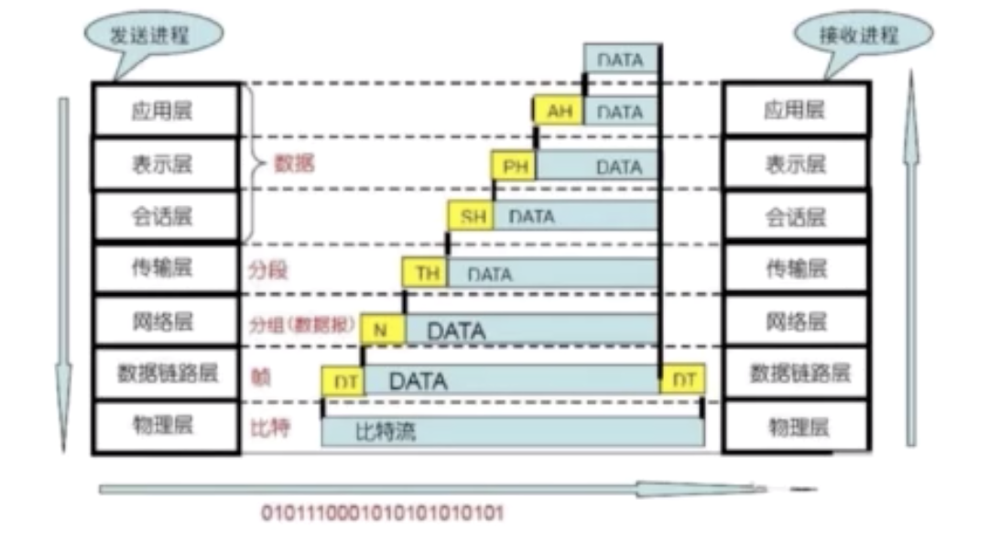
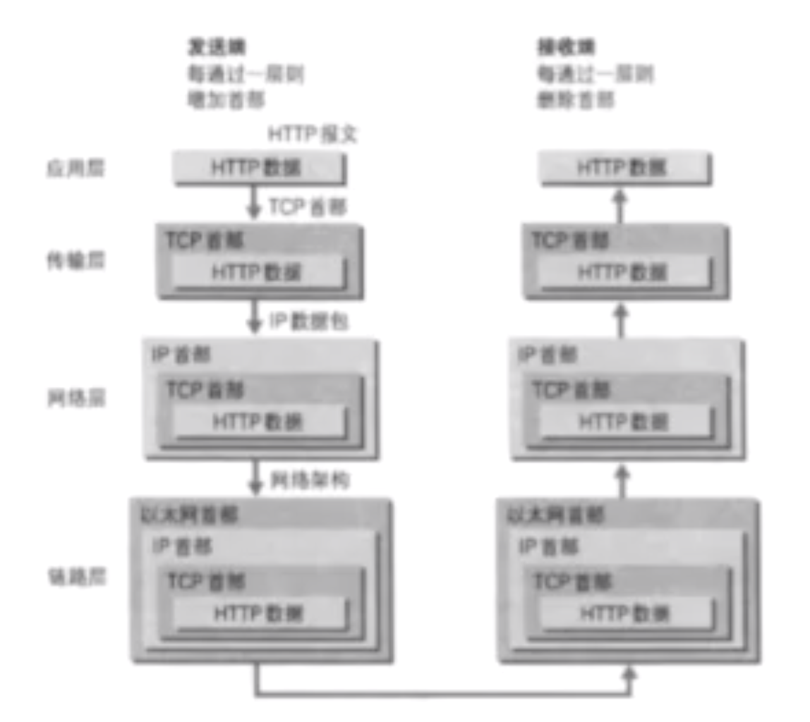
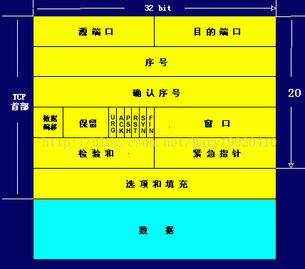
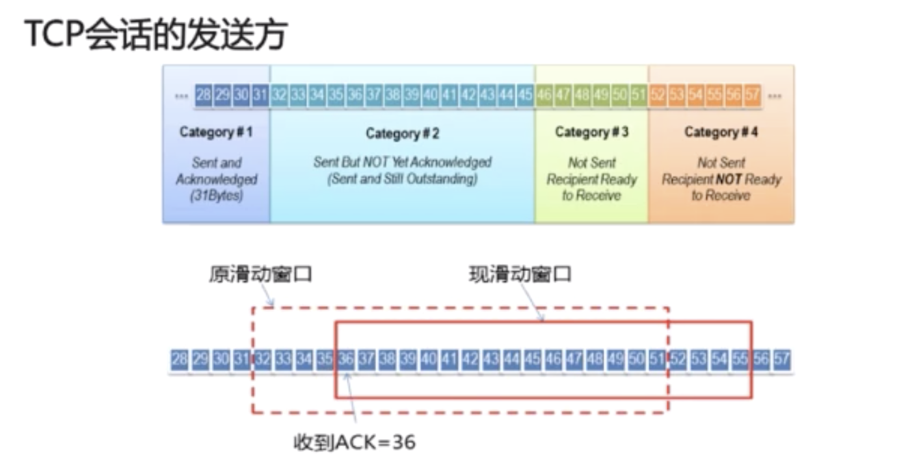
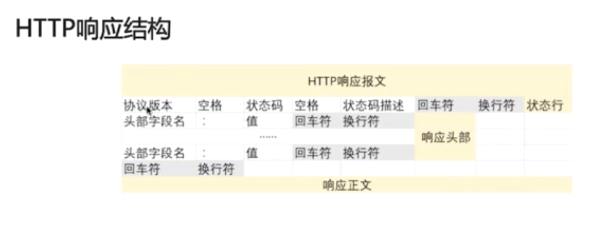
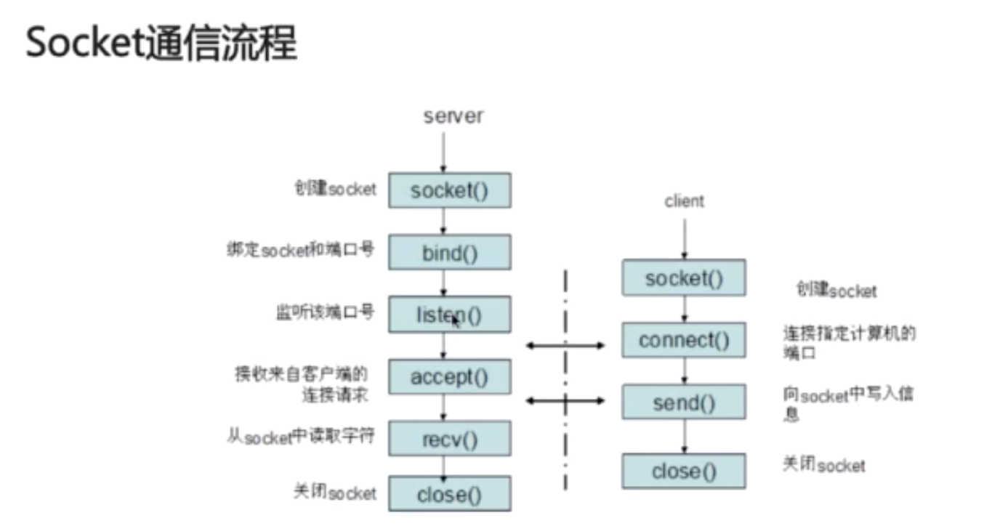
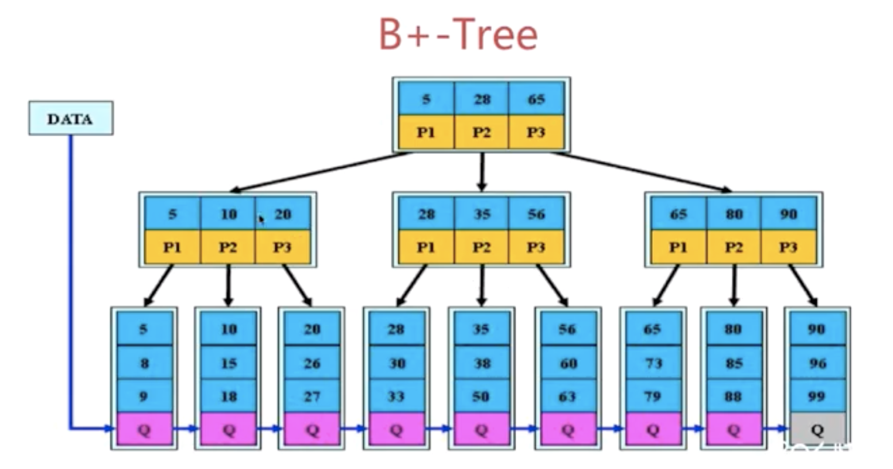
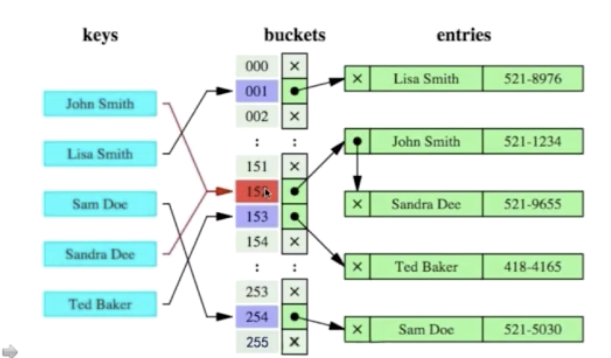
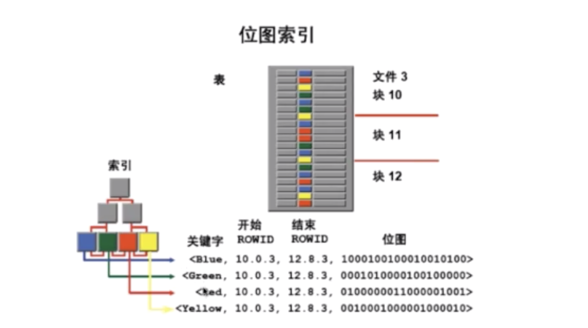
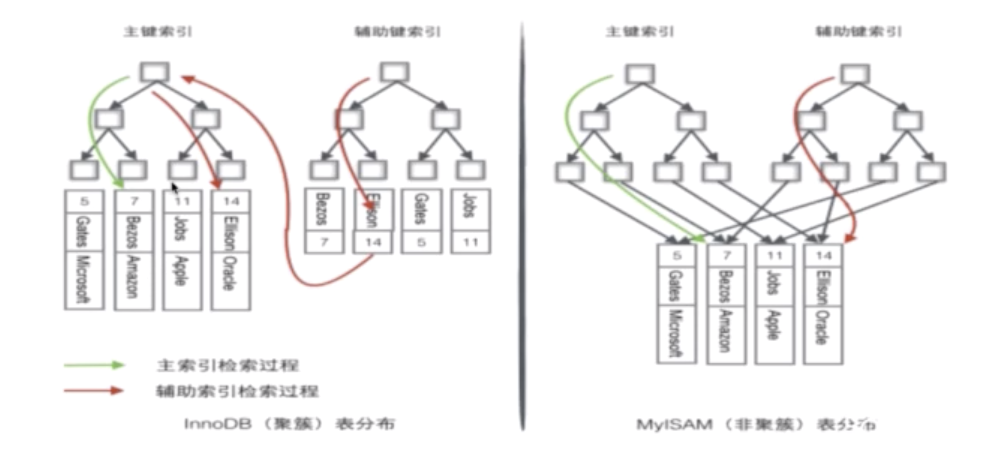

# Java基础

[TOC]


Jdk8 支持到2025

jdk11支持到2026


## 网络基础知识

### OSI开放式互联参考模型

1. 物理层：传输比特流

   机械、电子、定时通信信道上的原始比特流传输。

   模数转换与模数转换，**网卡**工作在这一层。

2. 数据链路层：

   物理寻址、同时将原始比特流转换为逻辑传输线路

   定义了如何格式化数据进行传输、以及如何控制对物理介质的访问，交换机工作在这一层。通常还提供错误检测。**交换机**工作在这一层。

3. 网络层：将网络地址翻译成对应的物理地址，并决定如何将数据从发送方路由到接受方。

   控制子网的运行，如逻辑编址、分组传输、路由选择。

   **路由器**属于网络层。需关注**IP**协议

4. 传输层：解决了传输质量问题，重要的一层。

   接收上一层的数据，在必要的时候把数据**分割**，并将这些数据交给网络层，且保证这些数据段有效到达对端（批量和可靠性的需求，于是有了传输层）

   需关注TCP协议、UDP协议

5. 会话层：建立和管理应用程序之间的通信

   不同机器上的用户之间建立及管理会话。（**自动收发包**、**自动寻址**）

6. 表示层：解决不同系统之间的通信语法问题。

   信息的语法语义以及他们的关联，如加密解密、转换翻译、压缩解压缩。

7. 应用层：规定发送方和接受方必须使用一个固定长度的消息头，消息头必须使用某种固定的组成，记录消息体的长度等信息。

   应用层方便应用更方便的传输数据。

   需关注**HTTP协议**


先自上而下，后自下而上处理数据头部




### TCP/IP

OSI的"实现”：TCP/IP


先自上而下，后自下而上处理数据头部




### TCP的三次握手

IP协议是**无连接的通信协议**，它不会占用两个正在通信的计算机之间的通信线路，ip协议降低了对网络线路的需求。每条线可以满足许多不同计算机之间的通信需要。IP协议没有做任何事情确认数据包是否发送成功或者包是否被破坏。IP数据包是不可靠的，需要由它的上层协议来作出控制。

传输控制协议TCP简介：





**1、端口号**：用来标识同一台计算机的不同的应用进程。

**1）源端口**：源端口和IP地址的作用是标识报文的返回地址。

**2）目的端口**：端口指明接收方计算机上的应用程序接口。

TCP报头中的源端口号和目的端口号同IP数据报中的源IP与目的IP唯一确定一条TCP连接。

**2、序号和确认号**：是TCP可靠传输的关键部分。**序号**是本报文段发送的数据组的第一个字节的序号。在TCP传送的流中，每一个字节一个序号。e.g.一个报文段的序号为300，此报文段数据部分共有100字节，则下一个报文段的序号为400。所以序号确保了TCP传输的有序性。确认号，即ACK，指明下一个期待收到的字节序号，表明该序号之前的所有数据已经正确无误的收到。确认号只有当ACK标志为1时才有效。比如建立连接时，SYN报文的ACK标志位为0。

**3、数据偏移／首部长度**：4bits。由于首部可能含有可选项内容，因此TCP报头的长度是不确定的，报头不包含任何任选字段则长度为20字节，4位首部长度字段所能表示的最大值为1111，转化为10进制为15，15*32/8 = 60，故报头最大长度为60字节。首部长度也叫数据偏移，是因为首部长度实际上指示了数据区在报文段中的起始偏移值。

**4、保留**：为将来定义新的用途保留，现在一般置0。

**5、控制位**：URG  ACK  PSH  RST  SYN  FIN，共6个，每一个标志位表示一个控制功能。

**1）URG**：紧急指针标志，为1时表示紧急指针有效，为0则忽略紧急指针。

**2）ACK**：**确认序号标志，为1时表示确认号有效，为0表示报文中不含确认信息，忽略确认号字段。**

**3）PSH**：push标志，为1表示是带有push标志的数据，指示接收方在接收到该报文段以后，应尽快将这个报文段交给应用程序，而不是在缓冲区排队。

**4）RST**：重置连接标志，用于重置由于主机崩溃或其他原因而出现错误的连接。或者用于拒绝非法的报文段和拒绝连接请求。

**5）SYN**：**同步序号，用于建立连接过程，在连接请求中，SYN=1和ACK=0表示该数据段没有使用捎带的确认域，而连接应答捎带一个确认，即SYN=1和ACK=1。**

**6）FIN**：**finish标志，用于释放连接，为1时表示发送方已经没有数据发送了，即关闭本方数据流。**

**6、窗口**：滑动窗口大小，用来告知发送端接受端的缓存大小，以此控制发送端发送数据的速率，从而达到流量控制。窗口大小时一个16bit字段，因而窗口大小最大为65535。

**7、校验和**：奇偶校验，此校验和是对整个的 TCP 报文段，包括 TCP 头部和 TCP 数据，以 16 位字进行计算所得。由发送端计算和存储，并由接收端进行验证。

**8、紧急指针**：只有当 URG 标志置 1 时紧急指针才有效。紧急指针是一个正的偏移量，和顺序号字段中的值相加表示紧急数据最后一个字节的序号。 TCP 的紧急方式是发送端向另一端发送紧急数据的一种方式。

**9、选项和填充**：最常见的可选字段是最长报文大小，又称为MSS（Maximum Segment Size），每个连接方通常都在通信的第一个报文段（为建立连接而设置SYN标志为1的那个段）中指明这个选项，它表示本端所能接受的最大报文段的长度。选项长度不一定是32位的整数倍，所以要加填充位，即在这个字段中加入额外的零，以保证TCP头是32的整数倍。

**10、数据部分**： TCP 报文段中的数据部分是可选的。在一个连接建立和一个连接终止时，双方交换的报文段仅有 TCP 首部。如果一方没有数据要发送，也使用没有任何数据的首部来确认收到的数据。在处理超时的许多情况中，也会发送不带任何数据的报文段。


套接字：IP + 端口号 + 协议


"握手"是为了建立连接，TCP三次握手的流程图如下：


建立全双工通信。


实验：wireshark抓包看看。


为什么需要三次握手才能建立起连接：

- 为了初始化Sequence Number的初始值。这个号要作为以后数据通信的序号。保证可靠性。


Server不断重试，第一次间隔1s，第二次2秒，4s，每次翻倍，重发5次。

针对**SYN Flood的防护措施**：

- SYN队列满后，通过tcp_syncookies参数回发SYN Cookies
- 若为正常连接则Client会回发SYN Cookie，直接建立连接


### TCP的四次挥手


等待2MSL的原因：

- 确保有足够的时间让对方收到ACK包
- 避免新旧连接混淆


即：对方关闭socket连接，我放忙于读或写，没有及时关闭连接。

- 检查代码，特别是释放资源的代码
- 检查配置，特别是处理请求的线程配置

获取当前系统各个状态的连接数：

```shell
netstat -n | awk '/^tcp/{++S[$NF]}END{for(a in S) print a,S[a]}'

注意awk的用法。
```


### TCP与UDP区别

UDP报文结构


UDP的特点：

- 面向非连接
- 不维护连接状态，支持同时向多个客户端传输相同的消息
- 数据包头只有8个字节，额外开销较小
- 吞吐量只受限于数据生成速率、传输速率以及机器性能
- 尽最大努力交付，不保证可靠交付，不需要维持复杂的链接状态表
- 面向报文，不对应用程序提交的报文信息进行拆分或者合并


**结论：**

- 面向连接VS无连 
- 单个点，多个点
- 可靠性
- 有序性
- 速度 udp适用在线视频等
- 量级 头部大小：tcp20个字节，udp8个字节


### TCP的滑动窗口协议

参考链接：

https://www.jianshu.com/p/51beb0b7cd57

背景：

将TCP与UDP这样的简单传输协议区分开来的是它传输数据的质量。TCP对于发送数据进行跟踪，这种数据管理需要协议有以下两大关键功能：
 **可靠性**：保证数据确实到达目的地。如果未到达，能够发现并重传。
 **数据流控**：管理数据的发送速率，以使接收设备不致于过载。+

要完成这些任务，整个协议操作是围绕滑动窗口确认机制来进行的。因此，理解了滑动窗口，也就是理解了TCP。


滑动窗口协议（Sliding Window Protocol），属于TCP协议的一种应用，用于网络数据传输时的流量控制，以避免拥塞的发生。该协议允许发送方在停止并等待确认前发送多个数据分组。由于发送方不必每发一个分组就停下来等待确认，因此该协议可以加速数据的传输，提高网络吞吐量。

TCP通过滑动窗口的概念来进行流量控制。

RTT（Round-Trip Time）：往返时延

RTO（Retransmission TimeOut）：重传超时时间





基于确认重传机制。


### HTTP相关

属于应用层协议

超文本传输协议HTTP主要特点：

- 支持客户/服务器模式

  

- 简单快速

- 灵活，contentType加以标记

- 无连接

- 无状态




请求/响应的步骤

- 客户端连接到Web服务器
- 发送HTTP请求
- 服务器接受请求并返回HTTP响应
- 释放连接TCP连接
- 客户端浏览器解析HTML内容


**面试题**：在浏览器地址栏键入URL，按下回车后经历的流程：

答案：

- DNS解析，将域名解析为IP地址
- TCP连接，建立连接，三次握手
- 发送HTTP请求
- 服务器处理请求并返回HTTP报文
- 浏览器解析渲染页面
- 连接结束，TCP四次挥手


#### 常见的HTTP状态码

五种可能的取值：


#### GET请求和POST请求的区别

从三个层面来解答

- Http报文层面：GET将请求信息放在URL，POST放在报文体中
- 数据库层面：GET符合幂等性和安全性，POST不符合
- 其他层面：GET可以被缓存、被存储，而POST不行


POST和PUT的区别

1. POST是用来提交数据的。提交的数据放在HTTP请求的正文里，目的在于提交数据并用于服务器端的存储，而不允许用户过多的更改相应数据（主要是相对于在url 修改要麻烦很多)。
2. PUT操作是幂等的。所谓幂等是指不管进行多少次操作，结果都一样。比如我用PUT修改一篇文章，然后在做同样的操作，每次操作后的结果并没有不同。
3. POST操作既不是安全的，也不是幂等的，比如常见的POST重复加载问题：当我们多次发出同样的POST请求后，其结果是创建出了若干的资源。
4. 安全和幂等的意义在于：当操作没有达到预期的目标时，我们可以不停的重试，而不会对资源产生副作用。从这个意义上说，POST操作往往是有害的，但很多时候我们还是不得不使用它。

5. 创建操作可以使用POST，也可以使用PUT，区别在于POST 是作用在一个集合资源之上的（/articles），而PUT操作是作用在一个具体资源之上的（/articles/123）；再通俗点说，如果URL可以在客户端确定，那么就使用PUT，如果是在服务端确定，那么就使用POST，比如说很多资源使用数据库自增主键作为标识信息，而创建的资源的标识信息到底是什么只能由服务端提供，这个时候就必须使用POST


#### Cookie和Session的区别

Cookie简介：（客户端的解决方案）（比如请记住我这类的实现方式）

- 是由服务器发送给客户端的特殊信息，以文本的形式存放在客户端
- 客户端再次请求的时候，会把Cookie回发
- 服务器接收到后，回解析Cookie生成与客户端想对应的内容


Session简介：

- 服务器端的机制，在服务器上保存的信息
- 解析客户端请求并操作session id，按需保存状态信息

session的实现方式：

- 使用Cookie来实现

  

- 使用URL回写来实现

  服务器在发送给浏览器页面的所有链接中都携带JSESSION _ID的参数


Cookie与Session的区别：


#### HTTP和HTTPS的区别


区别如下：


### SOCKET相关

IP地址 + 协议 + 端口号





## 数据库

知识点分布

关系型数据库

- 架构
- 索引
- 锁
- 语法
- 理论范式


面试题：如何设计一个关系型数据库？


### 索引模块

常见问题：

- 为什么要使用索引

  - 快速查询数据，避免全表扫描

- 什么样的信息能成为索引

  - 主键、唯一键以及普通键等

- 索引的数据结构

  - 生成索引，建立二叉查找树进行二分查找，平衡二叉树。主流是B+树，以及Hash结构、BitMap等，mysql不支持bitmap。基于 InnoDB 和 MyIsam 的 mysql 不显示支持 Hash。

- 密集索引和稀疏索引的区别

  


#### 二叉查找树


第二个问题：

树深度很深时，会有很多次io，导致性能反而不好。


#### B-Tree


3阶b树

m阶B树：定义：

- 根结点至少包含两个孩子
- 树中每个节点最多含有m个孩子（m>2)
- 除根节点和叶节点外，其他每个节点至少有ceil（m/2）个孩子
- 所有叶子节点都位于同一层


#### B+-Tree

B+树是B树的变体，其定义基本与B树相同，除了：

- 非叶子节点的子树指针与关键字个数相同。
- 非叶子节点的子树指针P[i]，指向关键字值[K[i], K[i+1]]的子树。
- 非叶子节点仅用来做索引，数据都保存在叶子节点中。
- 所有叶子节点均有一个链指针指向下一个叶子节点。方便范围统计


支持范围统计





B+Tree更适合用来做存储索引

- B+树的磁盘读写代价更低
- B+树的查询效率更加稳定
- B+库更有利于对数据库的扫描


#### Hash索引

查询效率比B+-Tree要高

缺点：

- 仅仅能满足"="，"IN"，不能使用范围查询
- 无法被用来避免数据的排序操作
- 不能利用部分索引键查询，对于组合索引，组合索引键合并后计算hash值。对于部分部分索引的查询是无法使用的。
- 不能避免表扫描，因为buckets数据可能不止一条
- 遇到大量Hash值相等的情况后性能并不一定会比B-Tree索引高




#### BitMap索引

 当表中字段只有几种值的时候，比如类别。位图索引就是很好的选择。



锁的力度非常大。新增或修改一条数据时，通常位于同一个位图的数据会被锁住。

不合适高并发的连机，及OLTP系统，适合于存粹统计的系统。


#### 密集索引和稀疏索引

密集索引和稀疏索引的区别

- 密集索引文件中的每个搜索码值都对应一个索引值
- 稀疏索引文件只为索引码的某些值建立索引项


MyISAM

使用的是稀疏索引

InnoDB：

- 若一个主键被定义，该主键则作为密集索引
- 若没有主键被定义，该表的第一个唯一非空索引则作为密集索引
- 若不满足以上条件，innodb内部会生成一个隐藏主键（密集索引）
- 非主键索引存储相关键位和其对应的主键值，包括两次查找





InnoDb的索引和数据都保存在ibd文件，而MyIsam的索引保存在MYI文件中，数据保存在MYD中。


衍生出来的问题，以mysql为例

#### 如何定位并优化慢查询sql

具体场景具体分析，只提出大致思路

- 根据慢日志定位慢查询sql

  ```
  show variables like '%quer%'
  关注：
  slow_query_log
  slow_query_log_file
  log_query_time=10.000000  // 超过10秒，需要记录
  
  show status like '%slow_queries%' // 查询慢查询数量，注意是本次session的
  
  set global slow_query_log=on;// 直接生效
  set global long_query_time=1;// 设置后需要重新连接才能生效
  ```

- 使用explain等分析工具分析sql

  ```
  explain select name from person_info_large order by name desc;
  ```

  - type 

    

       index,all 

  - extra

    

- 修改sql或者尽量让sql走索引

  添加索引

  查询优化器问题：

  

  mysql查询优化器最重要的目标是尽可能的使用索引， 并且使用最严格的索引来消除尽可能多的数据行，最终目标是提交select语句查找数据行而不是排除数据行。

  密集索引的叶子节点把其他列的数据也放在叶子节点了，这样反而效率会比稀疏索引要低。 稀疏索引只存储了关键字和主键的值。

- 联合索引的最左匹配原则的成因

  由多列组成的索引。

  

  成因：

  

- 索引是建立得越多越好吗

  - 数据量小的表不需要建立索引，建立会增加额外的索引开销
  - 数据变更需要维护索引，因此更多的索引意味着更多的维护成本
  - 更多的索引也意味着需要更多的空间


### 锁模块

常见问题：

1. MyISAM于InnoDB关于锁方面的区别

2. 数据库事务的四大特性

3. 事务隔离级别以及各级别下的并发访问问题

4. InnoDB可重复读隔离级别下如何避免幻读

5. RC、RR级别下的InnoDB的非阻塞读如何实现

   

#### MyISAM与InnoDB关于锁方面的区别

问题：

MyISAM于InnoDB关于锁方面的区别

- MyISAM默认用的是表级锁，不支持行级锁
- InnoDB默认用的是行级锁，也支持表级锁

读锁：共享锁  写锁：排他锁

innodb下，这种情况上了共享锁，此时是无法加排他锁。


思考：表级锁和索引无关，行级锁跟索引有没有关系？

InnoDB当不走索引时，整张表就会被锁住，此时查询用的是表级锁。用到索引时用的是行级锁或者Get锁。


MyISAM适合的场景：

- 频繁执行全表count语句 myisam用一个变量保存了数量
- 对数据进行增删改的频率不高，查询非常频繁
- 没事事务

InnoDB适合的场景

- 数据增删改查都相当频繁
- 可靠性要求比较高，要求支持事务


数据库锁的分类：


乐观锁：

通过一个version字段控制

读取数据时需要将version取出，更新时传入读取时的version，如果不匹配，则更新失败。

提交时去检查版本。


#### 数据库事务的四大特性

ACID

- 原子性（Atomic）：一个事务（transaction）中的所有操作，或者全部完成，或者全部不完成，不会结束在中间某个环节。事务在执行过程中发生错误，会被[回滚](https://zh.wikipedia.org/wiki/回滚_(数据管理))（Rollback）到事务开始前的状态，就像这个事务从来没有执行过一样。即，事务不可分割、不可约简。
- 一致性（Consistency）：在事务开始之前和事务结束以后，数据库的完整性没有被破坏。这表示写入的资料必须完全符合所有的预设[约束](https://zh.wikipedia.org/wiki/数据完整性)、[触发器](https://zh.wikipedia.org/wiki/触发器_(数据库))、[级联回滚](https://zh.wikipedia.org/wiki/级联回滚)等。
- **隔离性**（Isolation）：数据库允许多个并发事务同时对其数据进行读写和修改的能力，隔离性可以防止多个事务并发执行时由于交叉执行而导致数据的不一致。事务隔离分为不同级别，包括未提交读（Read uncommitted）、提交读（read committed）、可重复读（repeatable read）和串行化（Serializable）。
- 持久性（Durability） mysql通过redo log保证事务的持久性：事务处理结束后，对数据的修改就是永久的，即便系统故障也不会丢失。


问题：事务隔离级别以及各级别下的并发访问问题

事务并发访问引起的问题以及如何避免。

- 更新丢失：mysql所有事务隔离级别在数据库层面上均可避免

  

  基本不可能出现，mysql自身的锁机制已避免此类情况。

- 脏读：已提交读（READ-COMMITED）事务隔离级别以上可以避免

- 不可重复度：REPEATABLE-READ事务隔离级别以上可以避免

  虽然脏读可以避免读取未提交的数据，但是无法避免读取已提交的数据，两次读取可能不一致。																					

  

  **如何避免可重复读带来的问题？比如读到更新数据，并提交**

  

- 幻读：SERIALIZABLE事务隔离级别可避免。事务A读取与搜索条件相匹配的若干行，事务B已插入或删除行等方式来修改事务A的结果集，导致事务A看起来像出现幻觉一样。

  

  下面事务提交后，上面update更新显示影响了4条记录。

  

  Mysql的InnoDB在repeatable read 隔离级别下避免了上述的幻读问题。


MySQL通过锁机制创建不同的事务隔离级别

查询事务隔离级别：

```
select @@tx_isolation  
set session transaction isolation level read uncommitted
set session transaction isolation level repeatable read

MySQL: REPELATABLE-READ

READ-UNCOMMITED
READ-COMMITED
REPEATABLE-READ
SERIALIZABLE
```


注意：事务隔离级别越高，安全性越高，串行化越高，性能越差。

Oracle默认READ-COMMITED，MySQL默认REPEATABLE-READ


InnoDB可重复读隔离级别下如何避免幻读

- 表象：快照读（非阻塞读） -- 伪MVCC
- 内在：next-key锁（行锁+gap锁）

InnoDB RR级别主要通过引入next-key锁来避免幻读问题

Gap locak会用在非唯一索引或者不走索引的当前读，或者紧命中结果条件的结果集。


当前读和快照读


问题：RC、RR级别下的InnoDB的非阻塞读如何实现

- 数据行里的 DB_TRX_ID（最后一次修改事务Id）、DB_ROLL_PTR（回滚指针）、DB_ROW_ID（行号）字段

- undo日志，insert undo log，update undo log（delete，update时）

  

- read view


net-key锁（行锁+gap锁）

- 行锁：对单个行记录的锁
- Gap锁：间隙锁，为了防止同一事物的两次当前读，出现幻读情况。
  - 如果where条件全部命中，则不会用Gap锁，只会加记录锁
  - 如果where条件部分命中或者全不命中，则会加Gap锁


Gap锁会用在非唯一索引或者不走索引的当前读中

- 非唯一索引

  
  
- 不走索引

  


#### 锁总结

扩容redo log ，undo log ，以及bin log

**redo log：**

作用：

- 确保事务的持久性。
- 防止在发生故障的时间点，尚有脏页未写入磁盘，在重启mysql服务的时候，根据redo log进行重做，从而达到事务的持久性这一特性。

**undo log：**

作用：
　　保存了事务发生之前的数据的一个版本，可以用于回滚，同时可以提供多版本并发控制下的读（MVCC），也即非锁定读

内容：
　　逻辑格式的日志，在执行undo的时候，仅仅是将数据从逻辑上恢复至事务之前的状态，而不是从物理页面上操作实现的，这一点是不同于redo log的。


**binlog** 

作用：
　　1，用于复制，在主从复制中，从库利用主库上的binlog进行重播，实现主从同步。
　　2，用于数据库的基于时间点的还原。
内容：
　　逻辑格式的日志，可以简单认为就是执行过的事务中的sql语句。
　　但又不完全是sql语句这么简单，而是包括了执行的sql语句（增删改）反向的信息，
　　也就意味着delete对应着delete本身和其反向的insert；update对应着update执行前后的版本的信息；insert对应着delete和insert本身的信息。
　　在使用mysqlbinlog解析binlog之后一些都会真相大白。
　　因此可以基于binlog做到类似于oracle的闪回功能，其实都是依赖于binlog中的日志记录。


### 语法

#### 关键语法

- GROUP BY
  - 满足“SELECT子句中的列名必须为分组列或列函数
  - 列函数对于group by子句，定义的每个组各返回一个结果
- HAVING
  - 通常与GROUP BY子句一起使用
  - WHERE过滤行，HAVING过滤组
  - 出现同一sql的顺序：WHERE>GROUP BY>HAVING
- 统计相关：COUNT,SUM,MAX,MIN,AVG

eg：


### 理论范式

待补充

### 彩蛋

- 首轮：面试技术基本功

- 次轮：架构设计，通过技术解决某些场景下的问题

- 末轮：稳定性以及未来规划，压工资

  

准备过程

- 认真研究职位要求，提炼出特别需要准备的知识点

  岗位职责：


- 通过内部人士打听团队所做项目的信息，重点备战这些知识点


项目介绍如何表达比较好：

- 站在码农的角度介绍项目，**专注技术指标**以及解决思路
- 自信，脉络要清晰：项目用途-》自己的角色-》如何解决难题
- 项目若找不到难点，则谈谈改进，前提时熟悉相关涉及的知识点
- 师前用图形将你的项目勾画清楚


## Redis

主流应用架构


缓存中间件：Memcache和Redis的区别

Memcache：代码层次类似Hash

- 支持简单数据类型
- 不支持数据持久化存储
- 不支持主从
- 不支持分片

Redis

- 数据类型丰富
- 支持数据磁盘持久化存储
- 支持主从
- 支持分片


### 为什么Redis能这么快？

官方数据：1000000+QPS（QPS即query per second，每秒内查询次数）

- 完全基于内存，绝大部分请求是存储的内存操作，执行效率高
- 数据结构简单，对数据操作也简单
- 采用单线程，单线程也能处理高并发请求，想多核也可启动多实例
  - 主线程是单线程的，对于客户端所有读写请求都有一个主线程串行处理，因此多个客户端同时对一个键进行写操作时就不会有并发的问题，避免了频繁的上下文切换和锁竞争。
  - CPU并不是限制Redis性能的瓶颈，网络或者其他反而会先成为瓶颈，另外也可以采用启用多实例可实现多核
  - 所谓的单线程，是指处理网络请求时采用单线程处理，redis server肯定不止时单线程的。
- 使用多路I/O复用模型，非阻塞IO


#### 多路I/O复用模型

FD：File Descriptor，文件描述符：

一个打开的文件通过唯一的描述符进行引用，该描述符是打开文件的元数据到文件本身的映射


传统的阻塞I/O模型


多路I/O复用模型


Redis采用的I/O多路复用函数：epoll/kqueue/evport/select？

- 因地制宜，根据不同操作系统采用不同的多路复用函数
- 优先选择时间复杂度为O（1）的I/O多路复用函数作为底层实现
- 以时间复杂度为O（n）的select作为保底
- 基于react涉及模式监听I/O事件


### 说说你用过的Redis的数据类型

供用户使用的数据类型

- String：最基本的数据类型，最大存储512M，二进制安全（可以包含任何数据）

  

- Hash：String元素组成的字典，适合用于存储对象

- List：列表，按照String元素插入顺序排序

- Set：String元素组成的无序集合，通过哈希表实现，不允许重复

- Sorted Set：通过分数来为集合中的成员进行从小到大的排序

- 用于计数的HyperLogLog，用于支持存储地理位置信息的Goo


底层数据类型基础


### 从海量Key里查询出某一固定前缀的Key

留意细节

- 摸清数据规模，即问清楚边界

  


使用Keys对线上的业务的影响

KEYS pattern: 查找所有符合给定模式pattern的key

- KEYS指令一次性返回所有匹配的key
- 键的数量过大会使服务卡顿


`SCAN cursor [MATCH pattern`][COUNT count]

- 基于游标的迭代器，需要基于上一次的游标延续之前的迭代过程
- 以0作为游标开始一次新的迭代，知道命令返回游标0完成一次遍历
- 不保证每次执行都返回某个给定数量的元素，支持模糊查询
- 一次返回的数量不可控，只能是大概率符合count参数


需要去重。比如取出的数放在一个HashSet中去重。


### 如何实现分布式锁

分布式锁需要解决的问题

- 互斥性 任意时刻只能有一个客户端获得锁
- 安全性 
- 死锁
- 容错

SETNX key value：如果key不存在，则创建并赋值

- 时间复杂度：O（1）
- 返回值：设置成功，返回1；设置失败，返回0。


如何解决SETNX长期有效的问题

EXPIRE key seconds

- 设置key的生存时间，当key过期时（生存时间为0），会被自动删除

  

- 缺点：原子性得不到满足

  两个操作组合起来就不是原子了。


#### 大量的key同时过期的注意事项

集中过期，由于清楚大量的key很耗时，会出现短暂的卡顿现象

- 解决方案：在设置key的key的过期时间的适合，给每个key加上随机值


### 如何实现异步队列

使用List作为队列，RPUSH生产消息，LPOP消费消息

- 缺点：没有等待队列里有值就直接消费
- 弥补：
  - 可以通过在应用层引入sleep机制去调用LPOP重试
  - 通过BLPOP key [key ...] timeout：阻塞直到队列有消息或者超时

- 缺点：只提供一个消费者消费


pub/sub：主题订阅者模式

- 发送者（pub）发送消息，订阅者（sub）接收消息
- 订阅者可以订阅任意数量的频道


消息的发布时无状态的，无法保证可达。要解决这个问题，需要使用专业的消息队列，如kafka，rabbitmq等。


### Redis持久化

#### RDB（快照）持久化

保存某个时间点的全量数据快照


bgsave是否阻塞写入，一般设置为yes，防止出现一致性问题。


建议用no，redis本身属于cpu密集型服务器，cpu相对硬盘成本，选择cpu


禁用rdb方式

```
save ""
```


RDB文件可以通过两个命令生成：


lastsave 查看上次save成功的时间。


自动化出发RDB持久化的方式


BGSAVE原理


- 系统调用fork()：创建进程，实现了 Copy-On-Write


缺点：

- 内存数据的全量同步，数据量大会由于I/O而严重影响性能
- 可能会因为Redis挂掉而丢失从当前至最后一次快照期间的数据。


#### AOF持久化

保存写状态

- 记录下除了查询以外的所有变更数据库状态的指令
- 以append的形式追加保存到AOF文件中（增量）

```
appendonly yes
appendfilename "appendonly.aof"
appendfsync everysec/aways/no
```


日志重写解决

日志重写解决AOF文件大小不断增大的问题，原理如下：

- 调用fork()，创建一个子进程
- 子进程把新的AOF写到一个临时文件里，不依赖原来的AOF文件
- 主进程持续将新的变动同时写到内存和原来的AOF里
- 主进程获取子进程重写AOF的完成信号，往新AOF同步增量变动
- 使用新的AOF文件替换旧的AOF文件


### Redis的数据恢复

RDB和AOF文件共存情况下的恢复流程


RDB和AOF的优缺点：


#### RDB-AOF混合持久化方式

redis4.0之后


### Pipeline及主从同步


主从同步原理：


Redis Sentinel

解决主从同步Master宕机后的主从切换问题：

- 监控：检查主从服务器是否运行正常
- 提醒：通过API向管理员或者其他应用程序发送故障通知
- 自动故障迁移：主从切换


Redis Sentinel使用留言协议Gossip（febric也是使用这种协议）

在杂乱无章中寻求一致：


### Redis的集群原理

如何从海量数据里快速找到所需？

- 分片：按照某种规则去划分数据，分散存储在多个节点上
- 常规的按照哈希划分无法实现节点的动态增减


##### 一致性哈希算法


节点很少的时候：


Redis集群还可以引入哨兵。


## Linux

体系架构


### 如何找到特定的文件


### 检索文件内容


- 管道命令只能处理正确的输出，不能处理错误的输出。
- 右边的命令必须能够接收标准输入，否则传递过程中数据会被抛弃
- sed，awk，grep，cut，head，top，less，more，wc，join，sort，split等


### 对文件内容做统计


### 批量替换文件内容


```
sed -i 's/^Str/String/' replace.java
sed -i 's/\.$/\;/' replace.java

# 加g全文替换
sed -i 's/^Str/String/g' replace.java

# 删除空行  
sed -i '/^ *$/d' replace.java
# 删除包含Integer的行
sed -i '/Integer/d' replace.java
```


### 彩蛋：过程中容易忽略的细节

- 面试要偷偷摸摸地进行
- 面试时间不要一味将就对方
- 提离职要谨慎
- 好聚好散
- 时间衔接：一般15号之后离职，下个月15号前入职社保不会断


## Java底层知识：JVM


### 谈谈你对Java的理解

- 平台无关性
- GC
- 语言特性
- 面向对象
- 类库
- 异常处理


### 平台无关性

compile once，run anywhere 如何实现？


为什么JVM不直接将源码解析成机器码去执行

- 准备工作：每次执行都需要各种检查
- 兼容性：也可以将别的语言解析成字节码


#### JVM如何加载.class文件

Java虚拟机


#### 谈谈反射

​	JAVA反射机制是在运行状态中，对于任意一个类，都能够知道这个类的所有属性和方法；对于任意一个对象，都能够调用它的任意方法和属性；这种动态获取信息以及动态调用对象方法的功能称为java语言的反射机制。

反射的例子：


getDeclaredMethod：可以获取除了实现接口和继承外的所有方法

getMethod：可以获取所有公有方法，包括实现接口和继承的。


#### 类从编译到执行的过程


谈谈ClassLoader


ClassLoader的种类

- BootStrapClassLoader：C++编写，加载核心java.*

- ExtClassLoader：Java编写，加载扩展库javax.*

- AppClassLoader：Java编写，加载程序所在目录

- 自定义ClassLoader：Java编写，定制化加载

  关键函数：

  

  ```java
  public class MyClassLoader extends ClassLoader {
      private String path;
      private String classLoaderName;
  
      public MyClassLoader(String path, String classLoaderName) {
          this.path = path;
          this.classLoaderName = classLoaderName;
      }
  
      //用于寻找类文件
      @Override
      public Class findClass(String name) {
          byte[] b = loadClassData(name);
          return defineClass(name, b, 0, b.length);
      }
  
      //用于加载类文件
      private byte[] loadClassData(String name) {
          name = path + name + ".class";
          InputStream in = null;
          ByteArrayOutputStream out = null;
          try {
              in = new FileInputStream(new File(name));
              out = new ByteArrayOutputStream();
              int i = 0;
              while ((i = in.read()) != -1) {
                  out.write(i);
              }
          } catch (Exception e) {
              e.printStackTrace();
          } finally {
              try {
                  out.close();
                  in.close();
              } catch (Exception e) {
                  e.printStackTrace();
              }
          }
          return out.toByteArray();
      }
  }
  
  ```

  ```java
  public class ClassLoaderChecker {
      public static void main(String[] args) throws ClassNotFoundException, IllegalAccessException, InstantiationException {
          MyClassLoader m = new MyClassLoader("/Users/baidu/Desktop/", "myClassLoader");
          Class c = m.loadClass("Wali");
          System.out.println(c.getClassLoader());
          System.out.println(c.getClassLoader().getParent());
          System.out.println(c.getClassLoader().getParent().getParent());
          System.out.println(c.getClassLoader().getParent().getParent().getParent());
          c.newInstance();
      }
  }
  ```


谈谈类加载器的双亲委派机制

1. 自底向上检查类是否已经加载
2. 自顶向下尝试加载类


为什么要使用双亲委派机制去加载类

- 避免多份同样字节码加载


### 类的加载方式

- 隐式加载：new

- 显式加载：loadClass，forName等

  

LoadClass和forName的区别

- Class.forName得到的class是已经初始化完成的
- Classloader.loadClass得到的class是还没有链接的（为了延迟化加载）


#### 类的装载过程


### Java内存模型

内存简介：


32位和64位是指具体的寻址空间大小


地址空间的划分

- 内核空间
- 用户空间


JVM内存模型-JDK8


### 线程独占部分


局部变量表和操作数栈

- 局部变量表：包含方法执行过程中的所有变量
- 操作数栈：入栈、出栈、复制、交换、产生消费变量


递归为什么会引发java.lang.StackOverflowError异常？

不断创建栈帧，递归行数限制，空间不够。


本地方法栈

- 与虚拟机栈类似。


### 线程共享部分

#### 方法区

元空间（MetaSpace）与永久代（PermGen）的区别

存储Class的相关信息，均是方法区的实现。

- 元空间使用本地内存，而永久代使用的是jvm的内存

  java.lang.OutOfMemoryError:PermGen space不存在


MetaSpace相比PermGen的优势：

- 字符串常量池存在永久代中，容易出现性能问题和内存溢出
- 类和方法的信息大小很难确定，给永久代的大小指定带来了困难
- 永久代会为GC带来不必要的复杂性
- 方便HotSpot与其他JVM如Jrockit的集成


#### Java堆（Heap）

- 对象实例的分配区域

  

- GC管理的主要区域

  


JVM三大性能调优参数-Xms -Xmx -Xss的含义


- -Xss：规定了每个线程虚拟机栈（堆栈）的大小，一般256k足够，会影响并发线程数的大小
- -Xms：堆的初始值
- -Xmx：堆能达到的最大值 

**一般将-Xms和-Xmx设置成一样的，因为当内存不够扩容时会发生内存抖动影响程序运行时的稳定性。**


Java内存模型中堆和栈的区别——内存分配策略？

引入知识

- 静态存储：编译时确定每个数据目标在运行时的存储空间需求
- 栈式存储：数据区需求在编译时未知，运行时模块入口前确定
- 堆式存储：编译时或运行时模块入口都无法确定，动态分配


解答：

- 联系：引用对象、数组时，栈里定义变量保存堆中目标的首地址

  

- 区别

  - 管理方式：栈自动释放，堆需要GC
  - 空间大小：栈比堆小
  - 碎片相关：栈产生的碎片远小于堆
  - 分配方式：栈支持静态分配和动态分配，而堆仅支持动态分配
  - 效率：栈的效率比堆高


元空间、堆、线程独占部分间的联系——内存角度


输出：false，flase


输出：**false**(why)，true


### 找工作成功率较高的时期

金三银四

- 优势：供选择的公司多，机会多
- 劣势：人才供应量旺盛
- 劣势：成为备胎的概率大增，获取offer时间较慢
- 劣势：若无明显竞争力


临近年末的时候

谈薪方式一：直接和猎头表达

谈薪方式二：说出顾虑


## GC相关

归结为自动化的解决了两个问题：

- 对象自动内存分配问题
- 回收分配给对象的内存问题


### 对象被判定为垃圾的标准

没有被引用的对象

- 引用计数算法
- 可达性算法


- 优点：执行效率高，程序执行受影响较小
- 缺点：无法检测出循环引用的情况，导致内存泄漏


### 垃圾回收算法


GC的分类

- Minor GC
- Full GC


年轻代：尽可能快速地收集掉哪些生命周期短的对象

- Eden区 

- 两个Survivor区：为了来回复制计算年龄

  


-XX:MaxTenuringThreshold：晋升老年代年龄，默认15


老年代

- Full GC和Major GC
- Full GC 比Minor GC慢，但是不频繁

触发Full GC的条件

- 老年代空间不足
- 永久代空间不足 jdk7 以下
- CMS GC时出现promotion failed，concurrent mode failure
  - promotion failed：minor GC时，suvivor区域放不下，对象只能放入老年代，而老年代也放不下，此时会导致此错误。
  - 在执行cms GC时同时有对象要放入老年代中，而此时老年代空间不足
- Minor GC晋升到老年代的平均大小大于老年代的剩余空间
- 调用System.gc()：只是提醒虚拟机
- 使用RMI赖进行RPC或管理JDK应用，每小时执行1次Full GC


### 常见的垃圾收集器

JVM的运行模式

- Server
- Client

java -version 可以查看

```
[root@xfei-server ~]# java -version
java version "1.8.0_241"
Java(TM) SE Runtime Environment (build 1.8.0_241-b07)
Java HotSpot(TM) 64-Bit Server VM (build 25.241-b07, mixed mode)
```


垃圾收集器之间的联系


老版本，单线程是指会停顿其他说有业务进程。


默认的，-XX:+UseAdaptiveSizePolicy，将调优交给虚拟机做。

吞吐量=运行用户代码时间/（运行用户代码时间+垃圾收集时间）


jdk11：Epsilon GC 和ZGC  正在研发


GC相关的面试题


Java中的强引用、软引用、弱引用、虚引用有什么用？


弱引用作为哨兵，方便了解垃圾回收是什么时候执行的。


类层次结构


这块代码再过下？？


### 渠道

- 内推 推荐
  - 简历直达团队，避免非团队的人员筛选
  - 知己知彼
  - 避免简历被锁
- 招聘网站投递
  - 最不推荐的一种
    - 简历会被锁定
    - 太多的虚假信息
- 猎头招聘
  - 人性最真实的一面
  - 猎头对特定的公司、职位比较熟悉
  - 找干练的猎头：是否做到精准推送，建议是否足够好
  - 找多个猎头，多方面了解市场
  - 做好恶战的准备
  - 搭线练手公司


## Java多线程与并发

### 进程与线程

进程和线程的区别

进程是资源分配的最小单元，线程是CPU调度的最小单元

- 所有与进程相关的资源，都被记录再PCB中

  

- 进程是**抢占处理机的调度单位**；线程属于某个进程，共享其资源

- 线程只由堆栈寄存器、程序计数器和TCB组成

  


Java进程和线程的关系


进程和线程的由来


### Thread中start和run方法的区别


### Thread和Runnable是什么关系


```java
// 不推荐
public class MyThread extends Thread {
    private String name;
    public MyThread(String name){
        this.name = name;
    }
    @Override
    public void run(){
        for(int i = 0 ; i < 10 ; i ++){
            System.out.println("Thread start : " + this.name + ",i= " + i);
        }
    }
}

// 推荐
public class MyRunnable implements Runnable {
    private String name;
    public MyRunnable(String name){
        this.name = name;
    }
    @Override
    public void run(){
        for(int i = 0 ; i < 10 ; i ++){
            System.out.println("Thread start : " + this.name + ",i= " + i);
        }
    }
}

public class RunnableDemo {
    public static void main(String[] args) throws InterruptedException {
        MyRunnable mr1 = new MyRunnable("Runnable1");
        MyRunnable mr2 = new MyRunnable("Runnable2");
        MyRunnable mr3 = new MyRunnable("Runnable3");
        Thread t1 = new Thread(mr1);
        Thread t2 = new Thread(mr2);
        Thread t3 = new Thread(mr3);
        t1.start();
        t2.start();
        t3.start();
    }
}
```


### 线程的传参与返回

#### 如何给run()方法传承

- 构造函数传参
- 成员变量传参
- 回调函数传参？？？


#### 如何实现处理线程的返回值

实现的方式主要由三种

- 主线程等待法

  ```java
  public class CycleWait implements Runnable{
      private String value;
      public void run() {
          try {
              Thread.currentThread().sleep(5000);
          } catch (InterruptedException e) {
              e.printStackTrace();
          }
          value = "we have data now";
      }
  
      public static void main(String[] args) throws InterruptedException {
          CycleWait cw = new CycleWait();
          Thread t = new Thread(cw);
          t.start();
  //        while (cw.value == null){
  //            Thread.currentThread().sleep(100);
  //        }
          t.join();
          System.out.println("value : " + cw.value);
      }
  }
  ```

- 使用Thread类的join()阻塞当前线程以等待子线程处理完毕（更精准）

- 通过Callable接口实现：通过FutureTask Or 线程池获取

  - FutureTask

  ```java
  public class MyCallable implements Callable<String> {
      @Override
      public String call() throws Exception{
          String value="test";
          System.out.println("Ready to work");
          Thread.currentThread().sleep(5000);
          System.out.println("task done");
          return  value;
      }
  }
  ```

  ```java
  public class FutureTaskDemo {
      public static void main(String[] args) throws ExecutionException, InterruptedException {
          FutureTask<String> task = new FutureTask<String>(new MyCallable());
          new Thread(task).start();
          if(!task.isDone()){
              System.out.println("task has not finished, please wait!");
          }
          System.out.println("task return: " + task.get());
      }
  }
  ```

  - 线程池，实现线程池可以并发的提交多个callable方法去执行。

  ```java
  public class ThreadPoolDemo {
      public static void main(String[] args) {
          ExecutorService newCachedThreadPool = Executors.newCachedThreadPool();
          Future<String> future = newCachedThreadPool.submit(new MyCallable());
          if(!future.isDone()){
              System.out.println("task has not finished, please wait!");
          }
          try {
              System.out.println(future.get());
          } catch (InterruptedException e) {
              e.printStackTrace();
          } catch (ExecutionException e) {
              e.printStackTrace();
          } finally {
              newCachedThreadPool.shutdown();
          }
      }
  }
  ```

  

### 线程的状态


### sleep和wait的区别

基本的差别

- sleep是Thread类的一个方法，wait是Object类中定义的方法
- sleep()方法可以再任何地方使用
- wait()方法只能在synchronized方法或synchronized块中使用，因为只有当我已经获取锁了，我才能够去释放锁。


### notify和notifyall的区别


两个概念

- 锁池EntryList
- 等待池WaitSet


notify和notifyAll的区别


### yield


最终决定权还是在线程调度器中。


### 中断线程


### 线程状态以及状态之间的转换


### 谈判

- 尽量大厅公司岗位职位的薪酬幅度
- 感知目标公司的缺人程度，工作的紧急程度
- 最有效的方式是已经具备了有竞争力的offer


## Java并发原理

### Synchronized基本含义


### synchronized底层实现原理

实现synchronized的基础

- Java对象头
- Monitor


对象在内存中的布局

- 对象头

  对象头的结构

  

  - Mark Word：存储对象运行时数据，实现轻量级锁和偏向锁的关键
  - Class Metadata Address：类型指针指向对象的类元数据

  

- 实例数据

- 对齐填充


Monitor：每个Java对象天生自带一把看不见的锁


自旋锁与自适应自旋锁

自旋锁                               PreBlockSpin

- 许多情况下，共享数据的锁定状态持续时间较短，切换线程不值得。未获取锁的线程完全可以在门外等待，但不放弃cpu的时间，这种行为就是自旋
- 通过让线程执行忙循环等待锁的释放，不让出CPU
- 缺点：若锁被其他线程长时间占用，会带来许多性能上的开销。

自适应自旋锁


锁消除

**更彻底的优化**

- JIT 编译时，对运行上下文进行扫描，去除不可能存在竞争的锁


锁粗化

另一种极端

- 通过扩大加锁的范围，避免反复加锁和解锁


### synchronized和ReentrantLock

AbstractQueuedSynchronizer.java 队列同步器，JUC的核心


ReentrantLock（再入锁）java5之后实现


除非程序确实有公平性需要的时候再去使用它，会导致一定的开销


具体例子：ArrayBlockingQueue


### JMM的内存可见性

#### 什么是Java内存模型中的happens-before

Java内存模型JMM


volatile：JVM提供的轻量级同步机制

- 保证被volatile修饰的共享变量对所有线程总是可见的

  increase不是线程安全的。

  

  

  

- 禁止指令重排序优化

  

  


### CAS（Compare and Swap）

乐观锁

一种高效实现线程安全性的方法

- 支持原子更新操作，适用于计数器，序列发生器等场景
- 属于乐观锁机制，号称lock-free
- CAS操作失败时由开发者决定是继续尝试，还是执行别的操作


CAS思想：

- 包含三个操作数——内存位置（V）、预期原值（A）和新值（B）


CAS缺点：

- 若循环时间长，则开销很大
- 只能保证一个共享变量的原子操作
- ABA问题  解决：AtomicStampedReference


### Java线程池


#### Fork/Join框架


#### 为什么要使用线程池

- 降低资源消耗
- 提高线程的可管理性


#### Executor框架


- Executor：运行新任务的简单接口，将任务提交和任务执行细节解耦

  ```
  Thread t = new Thread();
  t.start();
  
  Thread t = new Thread();
  executor.execute(t);
  ```

- ExecutorService:具备管理执行器和任务生命周期的方法，提交任务机制更完善

- ScheduledExcutorService：支持Future和定期执行任务


#### ThreadPoolExecutor


worker继承自AbstractQueuedSynchronizer  （AQS）


构造函数的五个参数：

- corePoolSize：核心线程数量
- maximumPoolSize：线程不够用时能够创建的最大线程数
- workQueue：任务等待队列
- keepAliveTime：抢占的顺序不一定，看运气
- threadFactory:创建新线程，Executors.defaultThreadFactory()
- handler:线程池饱和策略
  - AboutPolicy：直接抛出异常，这是默认策略
  - CallerRunsPolicy：用调用者所在的线程来执行任务
  - DiscardOldestPolicy:丢弃队列中靠最前的任务，并执行当前任务
  - DiscardPolicy：直接丢弃任务
  - 实现RejectedExecutionHandler接口的自定义handler


流程图：


#### 线程池的状态


状态转换图


工作线程的生命周期


#### 线程池的大小如何选定

- CPU密集型：线程数=按照核数或者核数+1设定
- I/O密集型：线程数=CPU核数*（1+平均等待时间/平均工作时间）


## Java常用类库及技巧

### String，StringBuffer，StringBuilder的区别


### Java异常

异常处理机制主要回答了三个问题：

- What：异常类型回答了什么被抛出
- Where：异常堆栈跟踪回答了在哪抛出
- Why：异常信息回答了为什么被抛出


#### Error和Exception的区别


常见RuntimeException


#### Java的异常处理机制

- 抛出异常：创建异常对象，交由运行时系统处理
- 


#### Java异常的处理原则


#### 高效主流的异常处理框架


例如Spring：org.springframework.core.NestedRuntimeException

**Spring 异常处理框架**：查!!!


#### try catch 的性能问题

Java异常处理消耗性能的地方

- try-cache块影响JVM的优化
- 异常对象实例需要报错栈快照等信息，开销较大


结论：

仅捕获可能出现异常的必要的代码段，不要用一个大try包包住整个代码段，同时，也不要利用异常来控制代码流程，因为它的效率远没有if、else、switch之类的高。


#### Java集合框架

工作中消失而面试却长存的算法和数据结构

- 优秀的算法和数据结构被封装到了Java的集合框架


数据结构考点：


HashSet的底层通过HashMap实现。


TreeSet：NavigableMap-》TreeMap


hashcode、equals、compareTo方法：


