# 剑指offer-Java

[TOC]


Jdk8 支持到2025

jdk11支持到2026


## 网络基础知识

### OSI开放式互联参考模型

1. 物理层：传输比特流

   机械、电子、定时通信信道上的原始比特流传输。

   模数转换与模数转换，**网卡**工作在这一层。

2. 数据链路层：

   物理寻址、同时将原始比特流转换为逻辑传输线路

   定义了如何格式化数据进行传输、以及如何控制对物理介质的访问，交换机工作在这一层。通常还提供错误检测。**交换机**工作在这一层。

3. 网络层：将网络地址翻译成对应的物理地址，并决定如何将数据从发送方路由到接受方。

   控制子网的运行，如逻辑编址、分组传输、路由选择。

   **路由器**属于网络层。需关注**IP**协议

4. 传输层：解决了传输质量问题，重要的一层。

   接收上一层的数据，在必要的时候把数据**分割**，并将这些数据交给网络层，且保证这些数据段有效到达对端（批量和可靠性的需求，于是有了传输层）

   需关注TCP协议、UDP协议

5. 会话层：建立和管理应用程序之间的通信

   不同机器上的用户之间建立及管理会话。（**自动收发包**、**自动寻址**）

6. 表示层：解决不同系统之间的通信语法问题。

   信息的语法语义以及他们的关联，如加密解密、转换翻译、压缩解压缩。

7. 应用层：规定发送方和接受方必须使用一个固定长度的消息头，消息头必须使用某种固定的组成，记录消息体的长度等信息。

   应用层方便应用更方便的传输数据。

   需关注**HTTP协议**


先自上而下，后自下而上处理数据头部


### TCP/IP

OSI的"实现”：TCP/IP

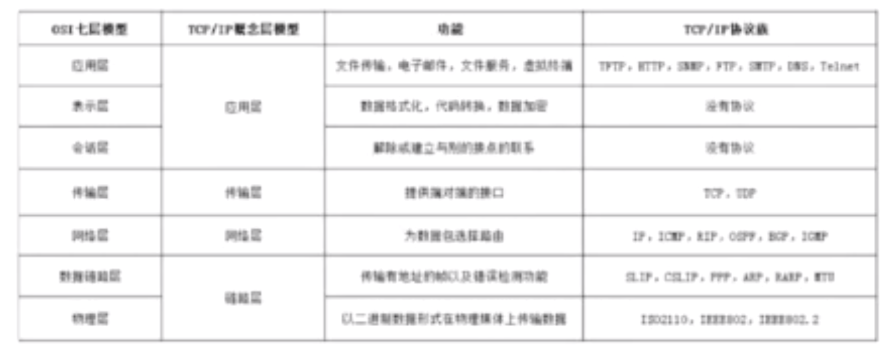


先自上而下，后自下而上处理数据头部


### TCP的三次握手

IP协议是**无连接的通信协议**，它不会占用两个正在通信的计算机之间的通信线路，ip协议降低了对网络线路的需求。每条线可以满足许多不同计算机之间的通信需要。IP协议没有做任何事情确认数据包是否发送成功或者包是否被破坏。IP数据包是不可靠的，需要由它的上层协议来作出控制。

传输控制协议TCP简介：

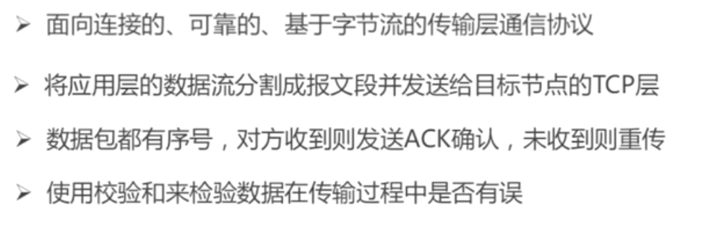


**1、端口号**：用来标识同一台计算机的不同的应用进程。

**1）源端口**：源端口和IP地址的作用是标识报文的返回地址。

**2）目的端口**：端口指明接收方计算机上的应用程序接口。

TCP报头中的源端口号和目的端口号同IP数据报中的源IP与目的IP唯一确定一条TCP连接。

**2、序号和确认号**：是TCP可靠传输的关键部分。**序号**是本报文段发送的数据组的第一个字节的序号。在TCP传送的流中，每一个字节一个序号。e.g.一个报文段的序号为300，此报文段数据部分共有100字节，则下一个报文段的序号为400。所以序号确保了TCP传输的有序性。确认号，即ACK，指明下一个期待收到的字节序号，表明该序号之前的所有数据已经正确无误的收到。确认号只有当ACK标志为1时才有效。比如建立连接时，SYN报文的ACK标志位为0。

**3、数据偏移／首部长度**：4bits。由于首部可能含有可选项内容，因此TCP报头的长度是不确定的，报头不包含任何任选字段则长度为20字节，4位首部长度字段所能表示的最大值为1111，转化为10进制为15，15*32/8 = 60，故报头最大长度为60字节。首部长度也叫数据偏移，是因为首部长度实际上指示了数据区在报文段中的起始偏移值。

**4、保留**：为将来定义新的用途保留，现在一般置0。

**5、控制位**：URG  ACK  PSH  RST  SYN  FIN，共6个，每一个标志位表示一个控制功能。

**1）URG**：紧急指针标志，为1时表示紧急指针有效，为0则忽略紧急指针。

**2）ACK**：**确认序号标志，为1时表示确认号有效，为0表示报文中不含确认信息，忽略确认号字段。**

**3）PSH**：push标志，为1表示是带有push标志的数据，指示接收方在接收到该报文段以后，应尽快将这个报文段交给应用程序，而不是在缓冲区排队。

**4）RST**：重置连接标志，用于重置由于主机崩溃或其他原因而出现错误的连接。或者用于拒绝非法的报文段和拒绝连接请求。

**5）SYN**：**同步序号，用于建立连接过程，在连接请求中，SYN=1和ACK=0表示该数据段没有使用捎带的确认域，而连接应答捎带一个确认，即SYN=1和ACK=1。**

**6）FIN**：**finish标志，用于释放连接，为1时表示发送方已经没有数据发送了，即关闭本方数据流。**

**6、窗口**：滑动窗口大小，用来告知发送端接受端的缓存大小，以此控制发送端发送数据的速率，从而达到流量控制。窗口大小时一个16bit字段，因而窗口大小最大为65535。

**7、校验和**：奇偶校验，此校验和是对整个的 TCP 报文段，包括 TCP 头部和 TCP 数据，以 16 位字进行计算所得。由发送端计算和存储，并由接收端进行验证。

**8、紧急指针**：只有当 URG 标志置 1 时紧急指针才有效。紧急指针是一个正的偏移量，和顺序号字段中的值相加表示紧急数据最后一个字节的序号。 TCP 的紧急方式是发送端向另一端发送紧急数据的一种方式。

**9、选项和填充**：最常见的可选字段是最长报文大小，又称为MSS（Maximum Segment Size），每个连接方通常都在通信的第一个报文段（为建立连接而设置SYN标志为1的那个段）中指明这个选项，它表示本端所能接受的最大报文段的长度。选项长度不一定是32位的整数倍，所以要加填充位，即在这个字段中加入额外的零，以保证TCP头是32的整数倍。

**10、数据部分**： TCP 报文段中的数据部分是可选的。在一个连接建立和一个连接终止时，双方交换的报文段仅有 TCP 首部。如果一方没有数据要发送，也使用没有任何数据的首部来确认收到的数据。在处理超时的许多情况中，也会发送不带任何数据的报文段。


套接字：IP + 端口号 + 协议


"握手"是为了建立连接，TCP三次握手的流程图如下：

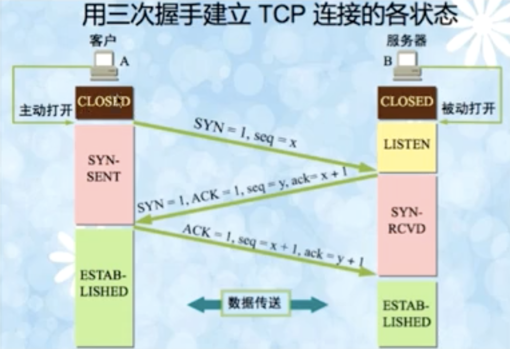


建立全双工通信。


实验：wireshark抓包看看。


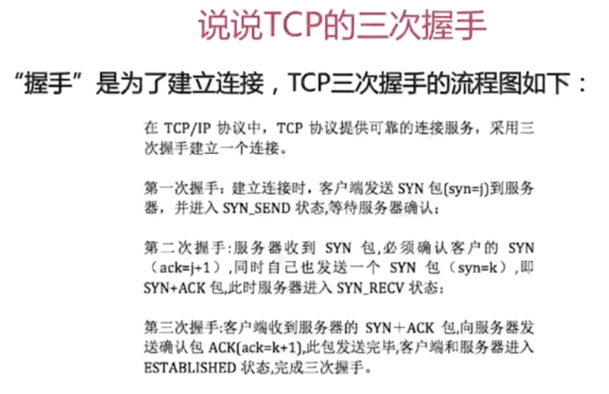

为什么需要三次握手才能建立起连接：

- 为了初始化Sequence Number的初始值。这个号要作为以后数据通信的序号。保证可靠性。


Server不断重试，第一次间隔1s，第二次2秒，4s，每次翻倍，重发5次。

针对**SYN Flood的防护措施**：

- SYN队列满后，通过tcp_syncookies参数回发SYN Cookies
- 若为正常连接则Client会回发SYN Cookie，直接建立连接


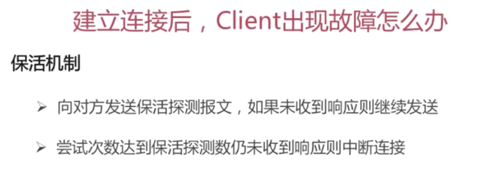


### TCP的四次挥手


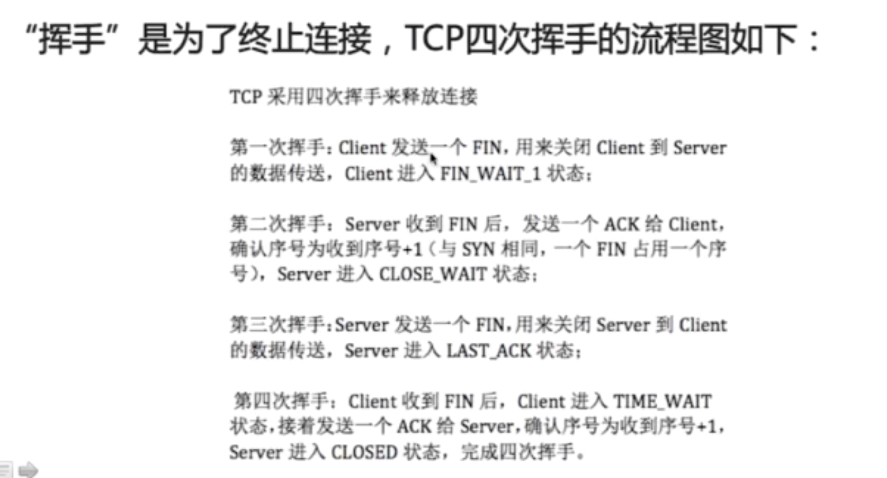

等待2MSL的原因：

- 确保有足够的时间让对方收到ACK包
- 避免新旧连接混淆


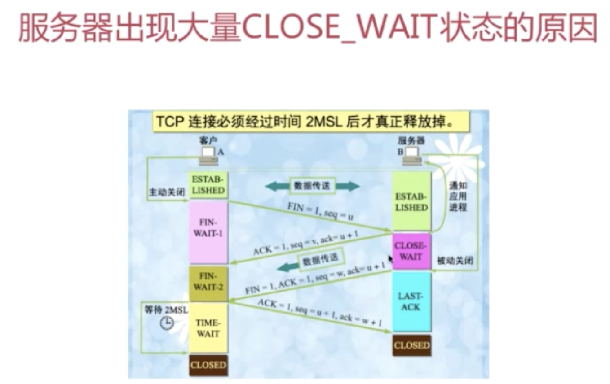

即：对方关闭socket连接，我放忙于读或写，没有及时关闭连接。

- 检查代码，特别是释放资源的代码
- 检查配置，特别是处理请求的线程配置

获取当前系统各个状态的连接数：

```
netstat -n | awk '/^tcp/{++S[$NF]}END{for(a in S) print a,S[a]}'

注意awk的用法。

```


### TCP与UDP区别

UDP报文结构

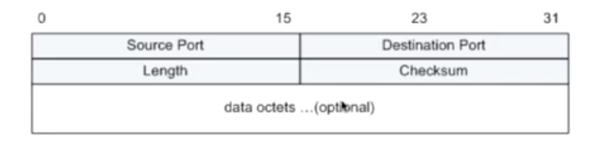

UDP的特点：

- 面向非连接
- 不维护连接状态，支持同时向多个客户端传输相同的消息
- 数据包头只有8个字节，额外开销较小
- 吞吐量只受限于数据生成速率、传输速率以及机器性能
- 尽最大努力交付，不保证可靠交付，不需要维持复杂的链接状态表
- 面向报文，不对应用程序提交的报文信息进行拆分或者合并


**结论：**

- 面向连接VS无连 单个点，多个点
- 可靠性
- 有序性
- 速度 udp适用在线视频等
- 量级 头部大小：tcp20个字节，udp8个字节


### TCP的滑动窗口

RTT（Round-Trip Time）：往返时延

RTO（Retransmission TimeOut）：重传超时时间


基于确认重传机制。


### HTTP相关

属于应用层协议

超文本传输协议HTTP主要特点：

- 支持客户/服务器模式

  

- 简单快速

- 灵活，contentType加以标记

- 无连接

- 无状态


请求/响应的步骤

- 客户端连接到Web服务器
- 发送HTTP请求
- 服务器接受请求并返回HTTP响应
- 释放连接TCP连接
- 客户端浏览器解析HTML内容


**面试题**：在浏览器地址栏键入URL，按下回车后经历的流程：

答案：

- DNS解析，将域名解析为IP地址
- TCP连接，建立连接，三次握手
- 发送HTTP请求
- 服务器处理请求并返回HTTP报文
- 浏览器解析渲染页面
- 连接结束，TCP四次挥手


#### 常见的HTTP状态码

五种可能的取值：


#### GET请求和POST请求的区别

从三个层面来解答

- Http报文层面：GET将请求信息放在URL，POST放在报文体中
- 数据库层面：GET符合幂等性和安全性，POST不符合
- 其他层面：GET可以被缓存、被存储，而POST不行


POST和PUT的区别

1. POST是用来提交数据的。提交的数据放在HTTP请求的正文里，目的在于提交数据并用于服务器端的存储，而不允许用户过多的更改相应数据（主要是相对于在url 修改要麻烦很多)。
2. PUT操作是幂等的。所谓幂等是指不管进行多少次操作，结果都一样。比如我用PUT修改一篇文章，然后在做同样的操作，每次操作后的结果并没有不同。
3. POST操作既不是安全的，也不是幂等的，比如常见的POST重复加载问题：当我们多次发出同样的POST请求后，其结果是创建出了若干的资源。
4. 安全和幂等的意义在于：当操作没有达到预期的目标时，我们可以不停的重试，而不会对资源产生副作用。从这个意义上说，POST操作往往是有害的，但很多时候我们还是不得不使用它。

5. 创建操作可以使用POST，也可以使用PUT，区别在于POST 是作用在一个集合资源之上的（/articles），而PUT操作是作用在一个具体资源之上的（/articles/123）；再通俗点说，如果URL可以在客户端确定，那么就使用PUT，如果是在服务端确定，那么就使用POST，比如说很多资源使用数据库自增主键作为标识信息，而创建的资源的标识信息到底是什么只能由服务端提供，这个时候就必须使用POST


#### Cookie和Session的区别

Cookie简介：（客户端的解决方案）（比如请记住我这类的实现方式）

- 是由服务器发送给客户端的特殊信息，以文本的形式存放在客户端
- 客户端再次请求的时候，会把Cookie回发
- 服务器接收到后，回解析Cookie生成与客户端想对应的内容

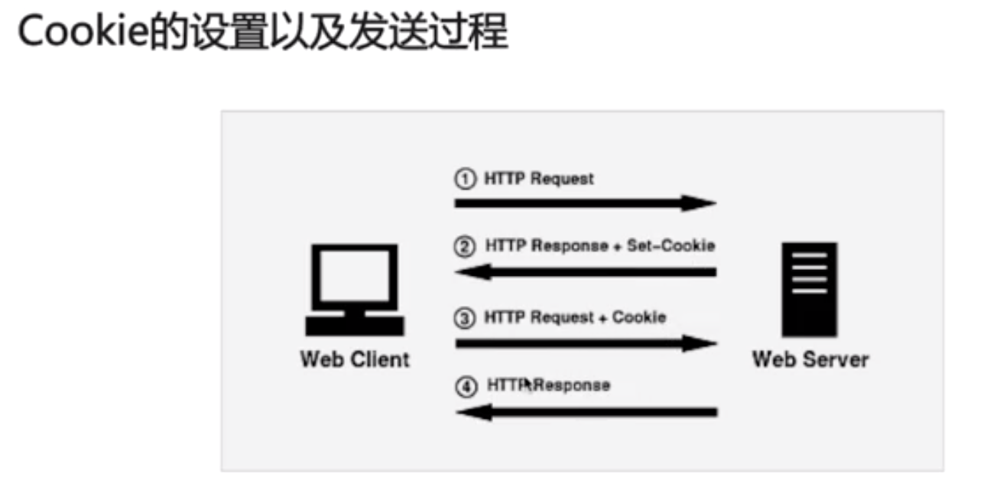

Session简介：

- 服务器端的机制，在服务器上保存的信息
- 解析客户端请求并操作session id，按需保存状态信息

session的实现方式：

- 使用Cookie来实现

  

- 使用URL回写来实现

  服务器在发送给浏览器页面的所有链接中都携带JSESSION _ID的参数


Cookie与Session的区别：


#### HTTP和HTTPS的区别


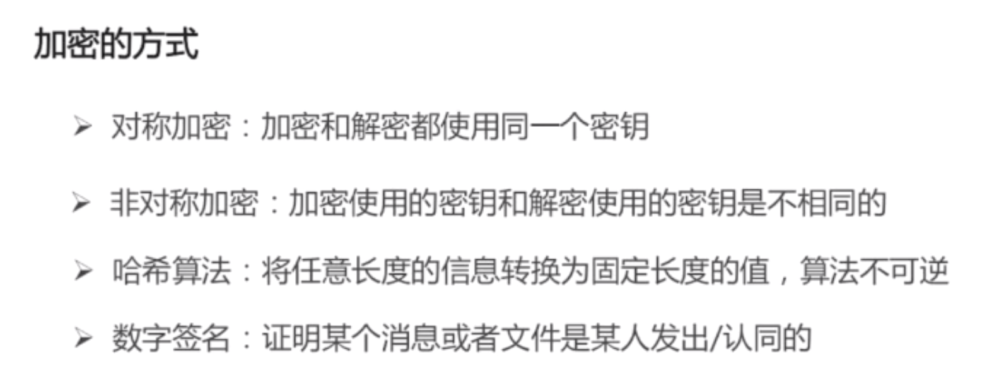


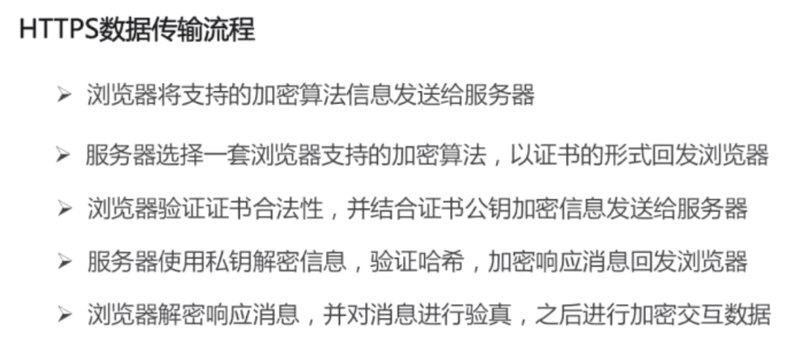

区别如下：

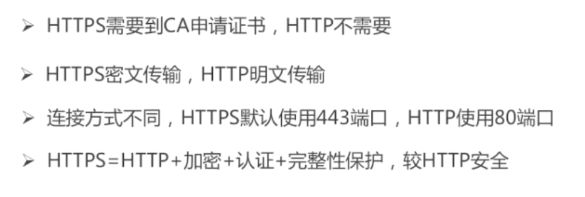

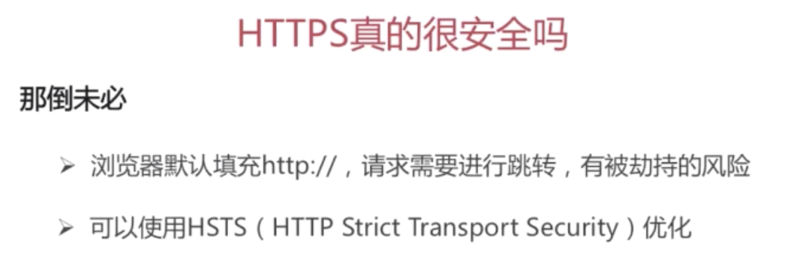


### SOCKET相关

IP地址 + 协议 + 端口号


## 数据库

知识点分布

关系型数据库

- 架构
- 索引
- 锁
- 语法
- 理论范式


面试题：如何设计一个关系型数据库？

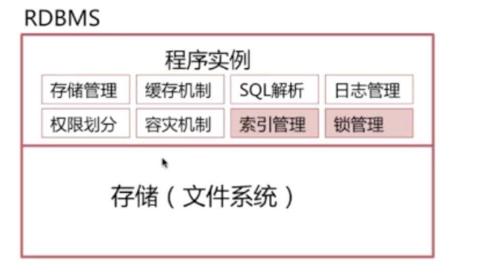


### 索引模块

常见问题：

- 为什么要使用索引

  - 快速查询数据，避免全表扫描

- 什么样的信息能成为索引

  - 主键、唯一键以及普通键等

- 索引的数据结构

  - 生成索引，建立二叉查找树进行二分查找，平衡二叉树，。主流是B+树，以及Hash结构、BitMap等，mysql不支持bitmap。基于InnoDB和MyIsam的mysql不显示支持Hash 

- 密集索引和稀疏索引的区别

  


#### 二叉查找树

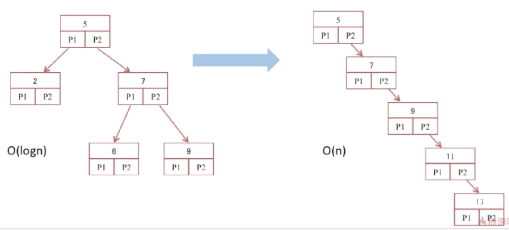


第二个问题：

树深度很深时，会有很多次io，导致性能反而不好。


#### B-Tree

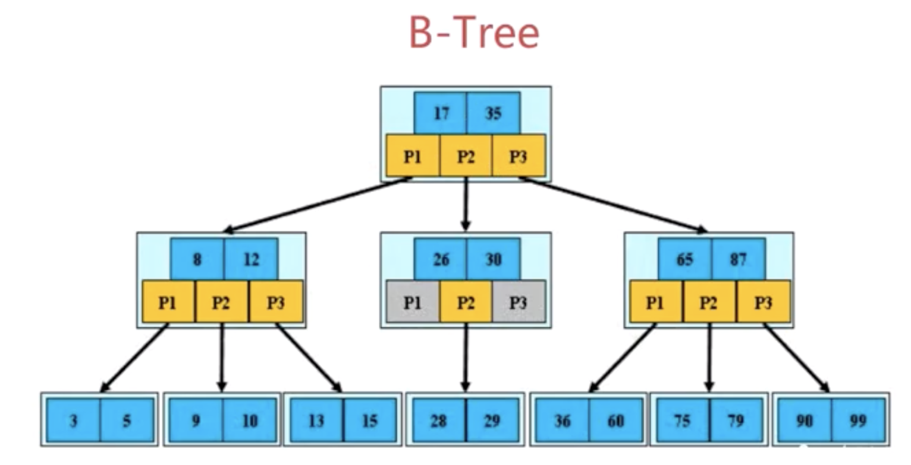

3阶b树

定义：

- 根结点至少包含两个孩子
- 树中每个节点最多含有m个孩子（m>2)
- 除根节点和叶节点外，其他每个节点至少有ceil（m/2）个孩子
- 所有叶子节点都位于同一层


#### B+-Tree

B+树是B树的变体，其定义基本与B树相同，除了：

- 非叶子节点的子树指针与关键字个数相同。
- 非叶子节点的子树指针P[i]，指向关键字值[K[i], K[i+1]]的子树。
- 非叶子节点仅用来做索引，数据都保存在叶子节点中。
- 所有叶子节点均有一个链指针指向下一个叶子节点。方便范围统计


支持范围统计


B+Tree更适合用来做存储索引

- B+树的磁盘读写代价更低
- B+树的查询效率更加稳定
- B+库更有利于对数据库的扫描


#### Hash索引

查询效率比B+-Tree要高


缺点：

- 仅仅能满足"="，"IN"，不能使用范围查询
- 无法被用来避免数据的排序操作
- 不能利用部分索引键查询，对于组合索引，组合索引键合并后计算hash值。对于部分部分索引的查询是无法使用的。
- 不能避免表扫描，因为buckets数据可能不止一条
- 遇到大量Hash值相等的情况后性能并不一定会比B-Tree索引高


#### BitMap索引

 当表中字段只有几种值的时候，比如类别。位图索引就是很好的选择。


锁的力度非常大。新增或修改一条数据时，通常位于同一个位图的数据会被锁住。

不合适高并发的连机，及OLTP系统，适合于存粹统计的系统。


#### 密集索引和稀疏索引

密集索引和稀疏索引的区别

- 密集索引文件中的每个搜索码值都对应一个索引值
- 稀疏索引文件只为索引码的某些值建立索引项


MyISAM

使用的是稀疏索引

InnoDB：

- 若一个主键被定义，该主键则作为密集索引
- 若没有主键被定义，该表的第一个唯一非空索引则作为密集索引
- 若不满足以上条件，innodb内部会生成一个隐藏主键（密集索引）
- 非主键索引存储相关键位和其对应的主键值，包括两次查找


InnoDb的索引和数据都保存在ibd文件，而MyIsam的索引保存在MYI文件中，数据保存在MYD中。

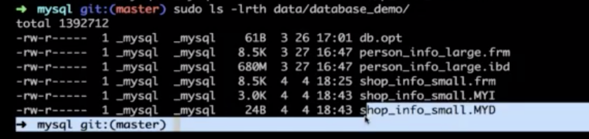


衍生出来的问题，以mysql为例

- 如何定位并优化慢查询sql

  具体场景具体分析，只提出大致思路

  - 根据慢日志定位慢查询sql

    ```
    show variables like '%quer%'
    关注：
    slow_query_log
    ```

    

  - 使用explain等分析工具分析sql

  - 修改sql或者尽量让sql走索引

- 联合索引的最左匹配原则的成因

- 索引是建立得越多越好吗

- 