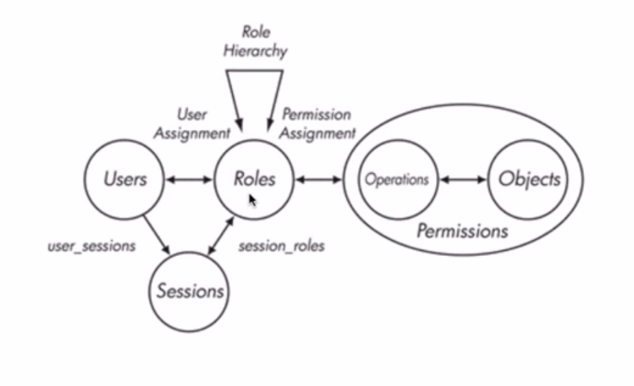
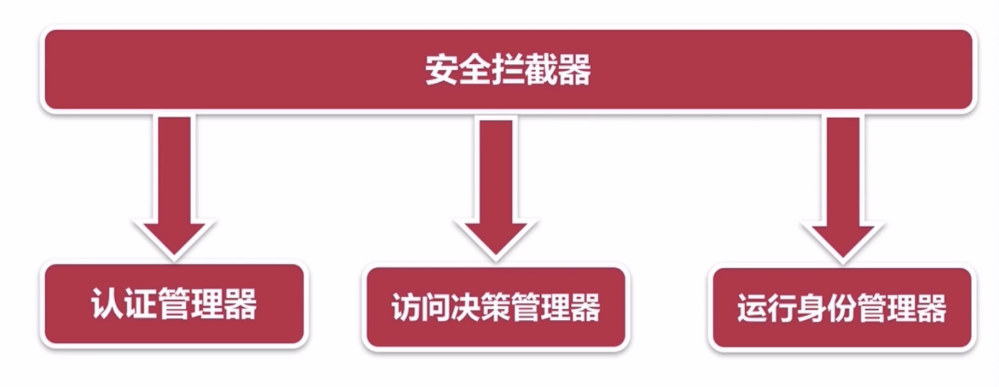
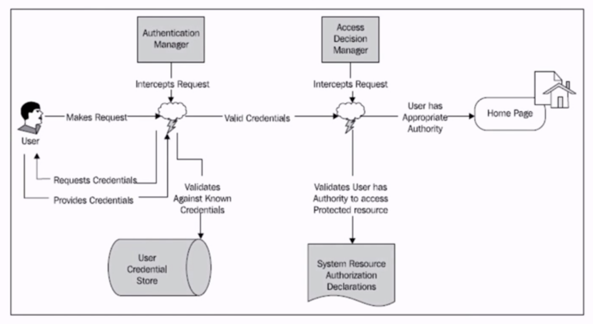
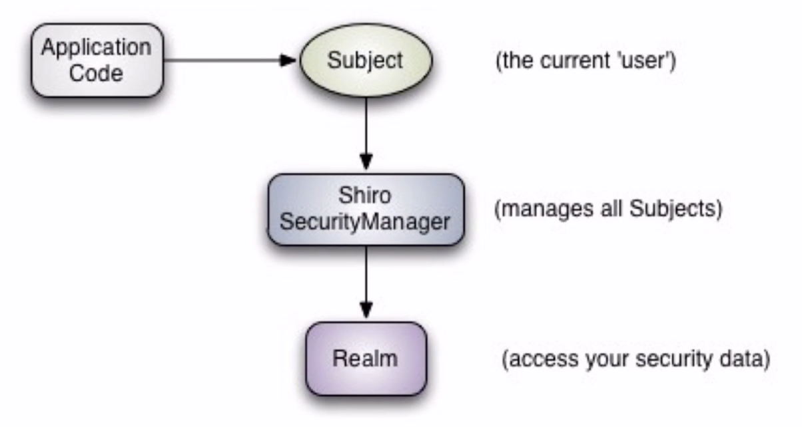
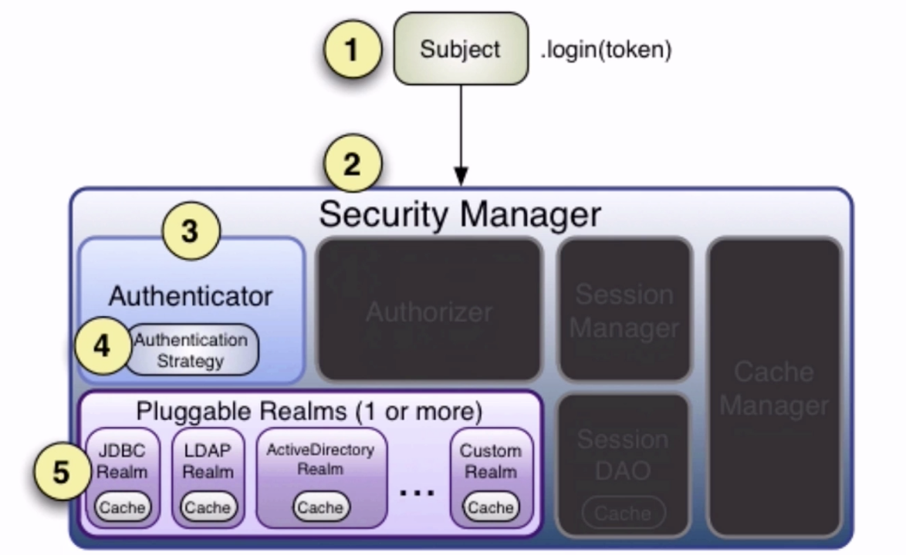
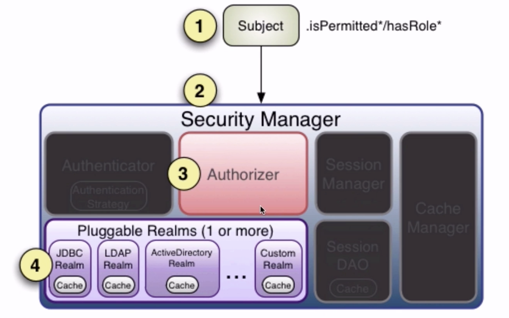
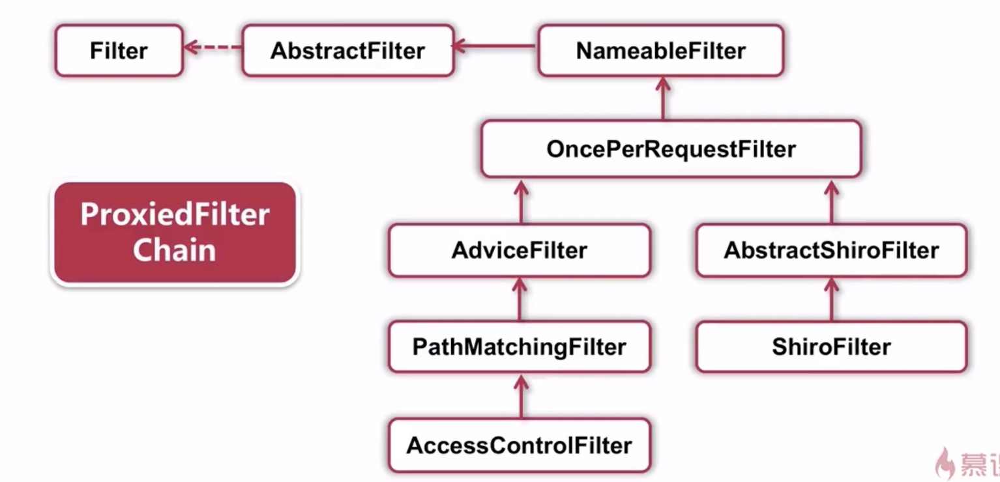
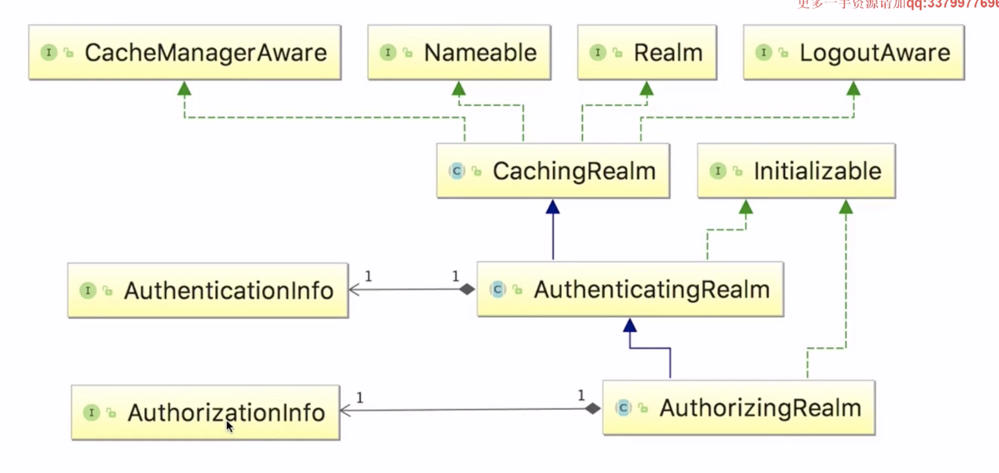

# 权限管理

[TOC]

为什么需要权限管理：

- 安全性：误操作、人为破坏、数据泄露
- 数据隔离：不同的权限能看到及操作不同的数据
- 明确职责：运营、客服等不同角色，leader和dev等不同级别

权限管理的核心：

- 用户-权限：人员少，功能固定，或者特别简单的系统

- RBAC模型（Role-Based Access Control）：用户于角色的权限控制。

  

理想的权限管理

- 能实现角色级权限：RBAC
- 能实现功能级、数据级权限
- 简单、易操作，能够应对各种需求

相关操作页面：

- 权限管理界面、角色管理界面、用户管理界面
- 角色和权限关系维护界面（核心）、用户和角色关系维护界面（核心）

主流开源权限管理项目：

- Spring Security
- Apache Shiro

## Spring Security

Spring Security



认证：为用户建立一个他所申明主体的一个过程

验证：某个用户能否执行某个操作

身份验证方式：

- basic认证
- digest认证
- X.509认证
- Ldap认证：轻量级目录访问协议
- form认证


### Spring Security 常用权限拦截器

ThreadLocal：存放的值是线程内共享的，线程间互斥的，主要用于线程内共享一些数据，避免通过参数来传递。

11个拦截器

SecurityContextPersistenceFilter

LogoutFilter

AbstractAuthenticationProcessingFilter

DefaultLoginPageGeneratiogFilter

BasicAuthenticationFilter

SecurityContextHolderAwareRequestFilter

RemeberMeAuthenticationFilter

AnonymousAuthenticationFilter

ExceptionTranslationFilter

SessionManagementFilter

FilterSecurityIntercetor

注意：

FilterChainProxy：按照顺序调用filter。

### SpringSecurity数据库管理

## 

UserDetail，Authentication

用户表、角色表、权限表，用户角色表、角色权限表

### Spring Security权限缓存

CachingUserDetailsServices

EhCacheBasedUserCache


### Spring Security自定义决策

AbstractAccessDecisionManager


### Spring Security优缺点

缺点：

- 配置文件多，角色被“编码”到配置文件和源文件中，RBAC不明显。
- 对于系统中用户、角色、权限之间的关系，没有可操作的界面。
- 大数据量情况下，几乎不可用


## Apache Shiro


应用安全的四大基石：

- 认证：用户登陆
- 授权
- 会话管理
- 加密

shiro会维护用户、维护权限，但是需要我们去给shiro注入。




Subject：当前的用户，门面

SecurityManager：管理所有的Subject


shiro架构图：


- Authenticator：用户认证管理器
- Authorizer：权限管理器
- SessionManager：会话管理器，没有web和ejb也可以对会话进行管理。servlet容器的话shiro会默认使用servlet的会话管理器。
- Session Dao：允许用户使用任何数据源存储数据
- Cache Manager：创建和维护一些在其他shiro组件中用到的cache实例，提高性能
- Cryptography：加密
- Realms：连接shiro和安全数据的桥梁，可以配置一个或多个realms，通常来说一个数据源会配置一个。

### 身份认证



可以自定义实现Authenticator，认证策略也可以自定义


### 授权



访问控制，角色，权限角色

### Shiro 权限拦截

AdviceFilter

ShiroFilter




### 会话管理

SessionManager  

SessionDao


### 权限缓存

Cache

- EhCache
- MapCache

CacheManager，CacheManagerAware，CachingRealm




## 编码

### 环境搭建和使用

Mybatis-generater使用

```
java -jar mybatis-generator-core-1.3.2.jar --configfile generator.xml --overwrite
```


项目接口的定义：

- 异常处理 : HandlerExceptionResolver

- ServerResponse

工具相关

- 校验工具 - validator

  依赖：validate-api,hibernate-validator

- Json转换工具-jackson convert

- 获取Spring 上下文 - applicationContext

- Http请求前后监听 - interceptor： HandlerInteceptorAdapter

### 部门模块开发

重点内容：

部门树的构造

前端mustache，部门树的渲染。


### 用户模块开发


