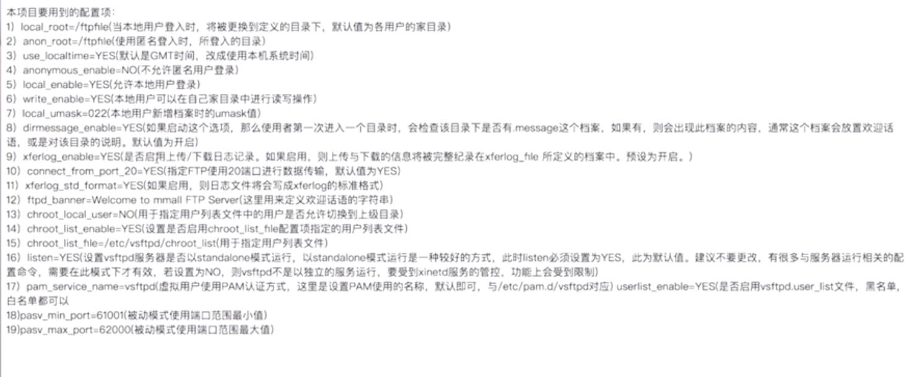
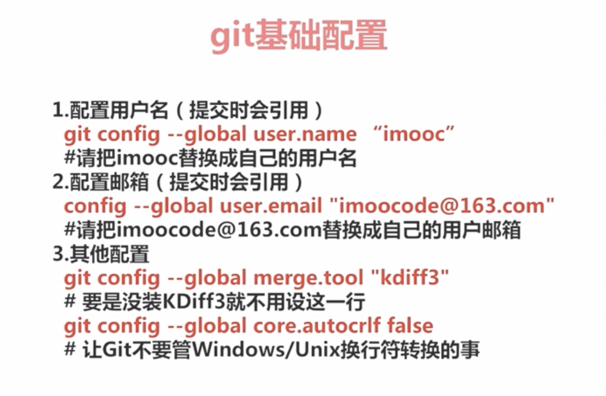

# 电商实战

## 准备阶段

### 安装服务

vsftp




nginx

环境准备

```
yum -y install gcc zlib zlib-devel pcre-devel openssl openssl-devel
```

下载源码包，nginx-1.10.2.tar.gz

安装

```
./configure --prefix=/usr/nginx
whereis nginx
make
make install
```


常用命令

```
/usr/local/nginx
/usr/local/nginx -s reload
```

配置

```
include vhost/*.conf

nginx要使用域名的话，本地玩必须增加host配置。
//autoindex 自动创建索引，如果索引不关，容易被穷举
server{
    listen 80;
    autoindex off;
    server_name www.imooc.com
    ...
}
location /{
    proxy_pass http://127.0.0.1:8080
    add_header Access-Control-Allow-Origin *;
}

图片，转发到目录
location /{
    root /ftpfile/image;
    add_header Access-Control-Allow-Origin *;
}
```


nginx+vsftp做成图片服务器。

图片上传通过vsftp，访问通过nginx


mysql

linux安装

安装

```
yum -y install mysql-server
#config at
/etc/my.conf

default-character-set=utf8
character-set-server=utf8

```

mysql CONFIG

```
# /G 是格式化
select user,host,password from mysql.user \G

change password
set password for root@localhost=password('root');

# delete anon user
delete from mysql.user where user='';
flush priviges

#insert user
insert into mysql.user(Host,User,Password) values(,,,,password("yourpassword"))
# attention
create USER 'mmail'@'%' IDENTIFIED BY 'mmail';

#create database
create database `mmall` default character set utf8 collate utf8_general_cli;
#grant privileges
grant all priviges on mmall.* to 'yourusername'@'%' identified by 'yourpassword' with grant option;


```


git介绍

安装





