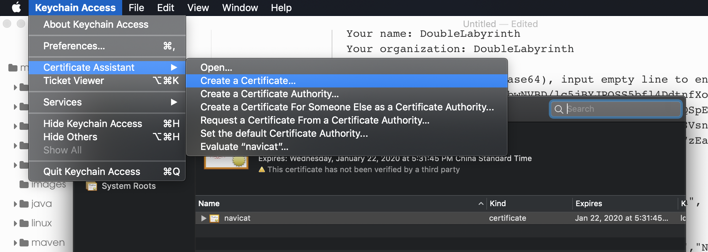
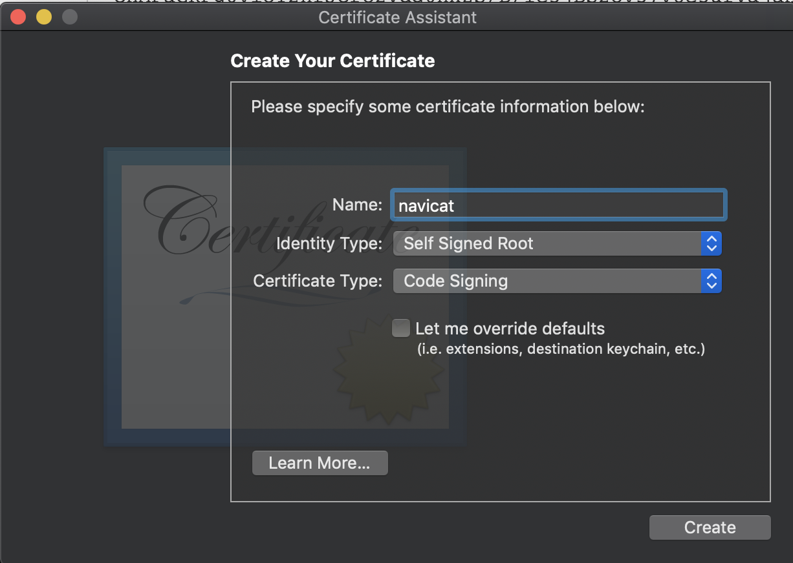

# NAVICAT 12.0.26 mac 激活

激活参考

https://github.com/DoubleLabyrinth/navicat-keygen/blob/mac/README.zh-CN.md

文章如下：

### Navicat Keygen

这份repo将会告诉你Navicat是怎么完成离线激活的。

[注册机是怎么工作的?](https://github.com/DoubleLabyrinth/navicat-keygen/blob/mac/HOW_DOES_IT_WORK.zh-CN.md)

#### 1. 如何编译

- 在编译之前，你应该确保你安装了`OpenSSL`和`rapidjson`。

  如果你有`brew`的话，你可以通过

  ```
  $ brew install openssl
  $ brew install rapidjson
  ```

  来完成它们的安装。

- Clone `mac` 分支，并编译keygen和patcher

  ```
  $ git clone -b mac https://github.com/DoubleLabyrinth/navicat-keygen.git
  $ cd navicat-keygen
  $ make all
  ```

  编译完成后你会在 `bin/` 文件夹下看到两个可执行文件：

  ```
  $ ls bin/
  navicat-keygen    navicat-patcher
  ```

#### 2. 如何使用这个Keygen

1. 编译好keygen和patcher。

2. 备份好 `Navicat Premium.app/Contents/MacOS/Navicat Premium` 以及Navicat中所有已保存的数据库连接（包括密码）。

3. 移除所有Navicat在 `Keychain.app` （即钥匙链）中保存的连接，如果有的话。

   你可以通过搜索关键词 `navicat` 来找到它们。

4. 使用`navicat-patcher`替换掉公钥：

   ```
   Usage:
       navicat-patcher <navicat executable file> [RSA-2048 PrivateKey(PEM file)]
   ```

   - `<navicat executable file>`: Navicat可执行文件的路径。

     **这个参数必须指定。**

   - `[RSA-2048 PrivateKey(PEM file)]`: RSA-2048私钥文件的路径。

     **这个参数是可选的。** 如果没有指定，`navicat-patcher`将会在当前目录下生成一个新的RSA-2048私钥文件`RegPrivateKey.pem`。

   **例如：**

   ```
   $ ./navicat-patcher /Applications/Navicat\ Premium.app/Contents/MacOS/Navicat\ Premium
   ```

   **仅对 Navicat Premium 版本 < 12.0.24 的说明：**

   如果你的Navicat版本小于12.0.24，那么`navicat-patcher`将不会修改目标文件。但你必须使用openssl将`RegPrivateKey.pem`转化为`rpk`文件，并用转化得到的文件替换

   ```
   /Applications/Navicat Premium.app/Contents/Resources/rpk
   ```

   如果你不知道怎么转化,这是一份样例：

   ```
   $ openssl rsa -in RegPrivateKey.pem -pubout -out rpk
   ```

5. **生成一份自签名的代码证书，并总是信任该证书。这一步非常重要。**

   **然后用codesign对Navicat Premium.app重签名。**

   ```
   $ codesign -f -s "Your self-signed code-sign certificate name" <path to Navicat Premium.app>
   ```

   **注意：**

   "Your self-signed code-sign certificate name"是你证书的名字，不是路径。

   **例如：**

   ```
   $ codesign -f -s "foobar" /Applications/Navicat\ Premium.app/
   ```

6. 接下来使用`navicat-keygen`来生成 **序列号** 和 **激活码**。

   ```
   Usage:
       navicat-keygen <RSA-2048 PrivateKey(PEM file)>
   ```

   - `<RSA-2048 PrivateKey(PEM file)>`: RSA-2048私钥文件的路径。

     **这个参数必须指定。**

   **例如：**

   ```
   ./navicat-keygen ./RegPrivateKey.pem
   ```

   你会被要求选择Navicat的语言以及输入主版本号。之后会随机生成一个 **序列号**。

   ```
   Which is your Navicat Premium language?
   0. English
   1. Simplified Chinese
   2. Traditional Chinese
   3. Japanese
   4. Polish
   5. Spanish
   6. French
   7. German
   8. Korean
   9. Russian
   10. Portuguese
   
   (Input index)> 1
   (Input major version number, range: 0 ~ 15, default: 12)> 12
   
   Serial number:
   NAVK-MWQR-LNXV-886V
   
   Your name: 
   ```

   你可以使用这个 **序列号** 暂时激活Navicat。

   接下来你会被要求输入`用户名`和`组织名`；请随便填写，但不要太长。

   ```
   Your name: DoubleLabyrinth
   Your organization: DoubleLabyrinth
   Input request code (in Base64), input empty line to end:
   ```

   之后你会被要求填入请求码。注意 **不要关闭注册机**.

7. **断开网络** 并打开Navicat。找到`注册`窗口，填入注册机给你的序列号。然后点击`激活`按钮。

8. 一般来说在线激活肯定会失败，这时候Navicat会询问你是否`手动激活`，直接选吧。

9. 在`手动激活`窗口你会得到一个请求码，复制它并把它粘贴到keygen里。最后别忘了连按至少两下回车结束输入。

   ```
   Your name: DoubleLabyrinth
   Your organization: DoubleLabyrinth
   
   Input request code (in Base64), input empty line to end:
   q/cv0bkTrG1YDkS+fajFdi85bwNVBD/lc5jBYJPOSS5bfl4DdtnfXo+RRxdMjJtEcYQnvLPi2LF0
   OB464brX9dqU29/O+A3qstSyhBq5//iezxfu2Maqca4y0rVtZgQSpEnZ0lBNlqKXv7CuTUYCS1pm
   tEPgwJysQTMUZf7tu5MR0cQ+hY/AlyQ9iKrQAMhHklqZslaisi8VsnoIqH56vfTyyUwUQXrFNc41
   qG5zZNsXu/NI79JOo7qTvcFHQT/k5cTadbKTxY+9c5eh+nF3JR7zEa2BDDfdQRLNvy4DTSyxdYXd
   sAk/YPU+JdWI+8ELaa0SuAuNzr5fEkD6NDSG2A==
   
   Request Info:
   {"K":"NAVADHCNP2OIDV46", "DI":"Y2eJk9vrvfGudPG7Mbdn", "P":"MAC"}
   
   Response Info:
   {"K":"NAVADHCNP2OIDV46","DI":"Y2eJk9vrvfGudPG7Mbdn","N":"DoubleLabyrinth","O":"DoubleLabyrinth","T":1537630251}
   
   License:
   oyoMYr9cfVGXeT7F1dqBwHsB/vvWj6SUL6aR+Kzb0lm5IyEj1CgovuSq+qMzFfx+
   oHMFaGKFg6viOY2hfJcrO2Vdq0hXZS/B/Ie3jBS2Ov37v8e3ufVajaH+wLkmEpLd
   xppCVLkDQjIHYR2IPz5s/L/RuWqDpEY4TPmGFF6q+xQMnqQA3vXPyG+JYMARXLru
   Y1gCDLN30v3DpyOeqKmFjUqiHK5h8s0NYiH2OpMyaCpi12JsF23miP89ldQp3+SJ
   8moo0cNGy7sFp2gX9ol2zVoo7qxfYlLl03f7CALJ6im0sx4yBsmlzFDdvpQUbXk8
   YZ5rT4LML2Fx6Wgnnklb5g==
   ```

10. 如果不出意外，你会得到一个看似用Base64编码的激活码。直接复制它，并把它粘贴到Navicat的`手动激活`窗口，最后点`激活`按钮。如果没什么意外的话应该能成功激活。

### 注意事项：

1. 第五步，需要自己手动生成一个证书，注意要手动生成证书。生成方式如下，这里有个坑，需要重启下电脑才能新建，否则报错。

   

   


附上一个Sublime Text3 破解方式：

```
## Sublime Text 3 Serial key build is 3176

> * Added these lines into  /etc/hosts 

127.0.0.1       www.sublimetext.com
127.0.0.1       license.sublimehq.com

> * Used the license key

----- BEGIN LICENSE -----
sgbteam
Single User License
EA7E-1153259
8891CBB9 F1513E4F 1A3405C1 A865D53F
115F202E 7B91AB2D 0D2A40ED 352B269B
76E84F0B CD69BFC7 59F2DFEF E267328F
215652A3 E88F9D8F 4C38E3BA 5B2DAAE4
969624E7 DC9CD4D5 717FB40C 1B9738CF
20B3C4F1 E917B5B3 87C38D9C ACCE7DD8
5F7EF854 86B9743C FADC04AA FB0DA5C0
F913BE58 42FEA319 F954EFDD AE881E0B
------ END LICENSE ------
```

